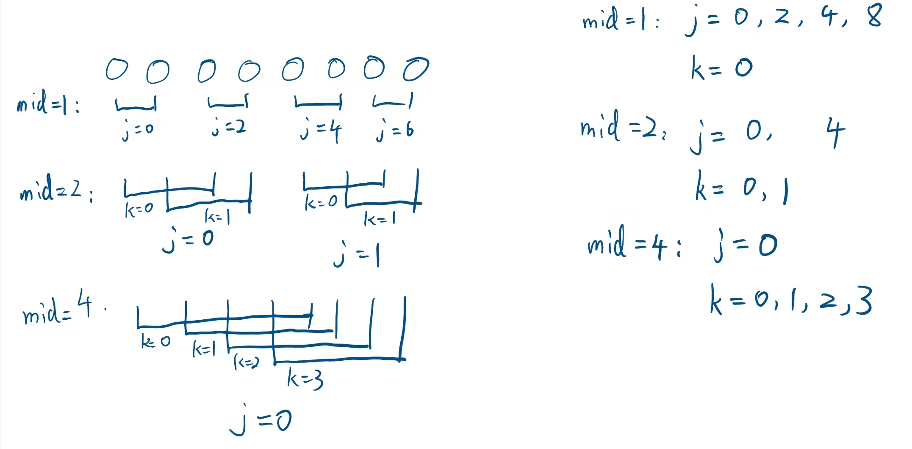

# 并行程序设计实验报告

> NTT 算法的实现及其 SIMD 优化

## 目录

- [并行程序设计实验报告](#并行程序设计实验报告)
  - [目录](#目录)
  - [前言](#前言)
  - [基础串行代码](#基础串行代码)
    - [`bit_reverse_permute`](#bit_reverse_permute)
    - [`ntt_forward_mont`](#ntt_forward_mont)
    - [`ntt_inverse_mont`](#ntt_inverse_mont)
      - [循环方向相反](#循环方向相反)
      - [蝶形运算的公式不同](#蝶形运算的公式不同)
      - [需要除以 n](#需要除以-n)
      - [旋转因子计算方式](#旋转因子计算方式)
    - [`poly_multiply_ntt`](#poly_multiply_ntt)
      - [扩展多项式长度到足够大的 2 的幂，使其能容纳乘法结果](#扩展多项式长度到足够大的-2-的幂使其能容纳乘法结果)
      - [进行比特翻转排列，为 NTT 做准备](#进行比特翻转排列为-ntt-做准备)
      - [将数据转换到 Montgomery 域](#将数据转换到-montgomery-域)
      - [对两个多项式进行 NTT 正变换](#对两个多项式进行-ntt-正变换)
      - [在点值表示下进行逐点乘法](#在点值表示下进行逐点乘法)
      - [对结果进行 NTT 逆变换](#对结果进行-ntt-逆变换)
      - [将结果从 Montgomery 域转回普通域并返回](#将结果从-montgomery-域转回普通域并返回)
  - [便于并行化的串行代码](#便于并行化的串行代码)
    - [当`mid`等于 1 时](#当mid等于-1-时)
    - [当`mid`等于 2 时](#当mid等于-2-时)
    - [当`mid`至少为 4 时](#当mid至少为-4-时)
  - [封装基本并行运算](#封装基本并行运算)
    - [基本结构与成员变量](#基本结构与成员变量)
    - [数据类型转换](#数据类型转换)
    - [Montgomery 规约](#montgomery-规约)
    - [基本运算函数](#基本运算函数)
  - [并行化代码](#并行化代码)
    - [并行化前向与逆向 NTT](#并行化前向与逆向-ntt)
      - [向量化蝶形运算](#向量化蝶形运算)
      - [标量/向量运算状态管理](#标量向量运算状态管理)
    - [并行化多项式乘法](#并行化多项式乘法)
      - [在比特翻转之后向量化](#在比特翻转之后向量化)
      - [在转换到 Montgomery 域之前向量化](#在转换到-montgomery-域之前向量化)
  - [性能分析](#性能分析)

## 前言

实际上，这次实验的过程非常曲折，代码重构了很多次。如果按照实际实验顺序撰写报告，报告内容会乱成一团，可能在做着并行的时候又跑去改串行代码了；而如果按照基础-进阶的顺序撰写报告，则会出现“报告前半部分的某处代码是由后半部分的另一处代码改进而来”这样的“倒叙”结构，观感较差。

因此，我打算打乱顺序，按照“基础串行代码——便于并行化的串行代码——封装基本并行运算——并行化代码”的顺序撰写。最后，我们统一分析各个步骤带来的性能提升。

注：这里我记录一下我的实际实验顺序：

1. 基本串行代码
2. Montgomery 模乘
3. Montgomery 模乘：并行化（即“封装基本并行运算“）
4. 重写逆变换
5. 撰写便于并行化的串行代码
6. 并行化

## 基础串行代码

我们首先实现了基本的 Montgomery 规约的模运算，并基于它实现了 NTT 前向与逆向变换，最后组装成多项式乘法函数。为此，我们实现了三个头文件`op.h`、`transform.h`和`ntt.h`，各个头文件及其包含的函数如下：

- `op.h`：将基于 Montgomery 规约的模运算（加、减、乘、快速幂、数论倒数）封装为`MontMod`类，各个成员函数的简要介绍如下。具体实现细节此处不做展示，但我们将在[封装基本并行运算](#封装基本并行运算)里展示其并行版本。
  - `from_u32`, `to_u32`：将`u32`普通整数转换为 Montgomery 数域中的`u32_mont`，以及转换回来的操作。
  - `reduce`：Montgomery 规约，是`from_u32`和`to_u32`的内部实现。
  - `add`, `sub`, `mul`：简单的加减乘法。其中乘法使用`1LL * ...`来扩大位数避免溢出。
  - `pow`：基于快速幂实现的模 p 幂运算。此处不针对快速幂算法展开。
  - `inv`：基于费马小定理（如果 \( m \) 是质数且 \( a \not\equiv 0 \pmod{m} \)，则 \( a^{-1} \equiv a^{m-2} \pmod{m} \)）实现的模 p 倒数。
- `transform.h`：、NTT 正反变换
  - `ntt_forward_mont`, `ntt_inverse_mont`：NTT 正变换与逆变换。
- `ntt.h`：使用 NTT 的多项式乘积运算
  - `poly_multiply_ntt`：使用 NTT 进行多项式乘法。

除此之外，还有两个辅助头文件`type.h`和`utils.h`：

- `type.h`：定义变量类型`using u32 = uint32_t; using u64 = uint64_t;`
- `utils.h`：实现辅助操作（扩展向量长度到 2 的幂次）
  - `expand_n`, `expand_a`：扩展数组长度到 2 的幂次、根据扩展后的长度**安全地**扩展向量。
  - `bit_reverse_permute`：对给定的向量进行 bit-reverse 置换。此处我们**相信**向量的长度是 2 的幂次。

下面，我们就`bit_reverse_permute`、`ntt_forward_mont`、`ntt_inverse_mont`和`poly_multiply_ntt`的实现进行简要阐述：

### `bit_reverse_permute`

`bit_reverse_permute`函数实现了比特翻转排列，是 NTT 算法的预处理步骤。在 NTT 的过程中，我们需要按照特定的顺序访问数组元素，而比特翻转排列正是提供了这种顺序。具体实现如下：

首先确定序列长度 n 的二进制位数 lg_n：

```cpp
u32 lg_n = 0;
while ((1u << lg_n) < n)
    ++lg_n;
```

然后对每个位置 i 计算其比特翻转后的位置 j：

```cpp
for (u32 i = 0; i < n; ++i)
{
    u32 j = 0;
    for (u32 k = 0; k < lg_n; ++k)
        if (i & (1 << k))
            j |= (1 << (lg_n - 1 - k));
```

最后当 i < j 时交换元素，避免重复交换：

```cpp
    if (i < j)
    {
        auto tmp = a[i];
        a[i] = a[j];
        a[j] = tmp;
    }
}
```

这个函数不适合 SIMD 优化，因为其内存访问模式不连续，且每次操作依赖于计算结果，无法批量并行处理。

### `ntt_forward_mont`

`ntt_forward_mont`实现了基于 Montgomery 规约的 NTT 正变换。NTT 正变换将多项式从系数表示转换为点值表示，其核心是蝶形运算。

函数的基本结构是三层嵌套循环：

```cpp
for (u32 mid = 1; mid < n; mid <<= 1)
{
  u32_mont Wn_mont = montMod.pow(omega_mont, (p - 1) / (mid << 1));
  for (u32 j = 0; j < n; j += (mid << 1))
  {
    u32_mont w_mont = montMod.from_u32(1);
    for (u32 k = 0; k < mid; ++k, w_mont = montMod.mul(w_mont, Wn_mont))
    {
      ...
    }
  }
}
```

其中：

- 第一层循环控制变量`mid`表示当前蝶形运算的步长，从 1 开始倍增到 n/2
- 第二层循环控制变量`j`表示当前处理的起始位置，每次跳过两个`mid`的长度
- 第三层循环控制变量`k`在当前步长`mid`内进行迭代，同时计算旋转因子`w`

蝶形运算的核心计算如下：

```cpp
u32_mont x_mont = a_mont[j + k];
u32_mont y_mont = montMod.mul(w_mont, a_mont[j + k + mid]);
a_mont[j + k] = montMod.add(x_mont, y_mont);
a_mont[j + k + mid] = montMod.sub(x_mont, y_mont);
```

这里使用 Montgomery 域中的加法、减法和乘法运算，避免了直接的模运算，提高了计算效率。每次蝶形运算都会将`a[j+k]`和`a[j+k+mid]`更新为它们的和与差（后者还需要乘以旋转因子）。

### `ntt_inverse_mont`

`ntt_inverse_mont`实现了基于 Montgomery 规约的 NTT 逆变换，将点值表示转换回系数表示。逆变换与正变换有几个关键区别：

#### 循环方向相反

正变换从小到大(mid 从 1 到 n/2)，逆变换从大到小(mid 从 n/2 到 1)

```cpp
for (u32 mid = n >> 1; mid > 0; mid >>= 1)
```

#### 蝶形运算的公式不同

逆变换中，加法部分相同，但减法结果需要乘以旋转因子后才赋给 a[j+k+mid]

```cpp
u32_mont x_mont = a_mont[j + k];
u32_mont y_mont = a_mont[j + k + mid];
a_mont[j + k] = montMod.add(x_mont, y_mont);
a_mont[j + k + mid] = montMod.mul(w_mont, montMod.sub(x_mont, y_mont));
```

#### 需要除以 n

（在有限域中即乘以 n 的模逆元）

```cpp
u32_mont inv_n = montMod.inv(montMod.from_u32(n));
for (u32 i = 0; i < n; ++i)
  a_mont[i] = montMod.mul(a_mont[i], inv_n);
```

#### 旋转因子计算方式

也与正变换略有不同，使用了原根的逆：

```cpp
u32_mont Wn_mont = montMod.pow(omega_mont, (p - 1) / (mid << 1));
```

### `poly_multiply_ntt`

`poly_multiply_ntt`实现了基于 NTT 的多项式乘法，其基本步骤如下：

#### 扩展多项式长度到足够大的 2 的幂，使其能容纳乘法结果

```cpp
u32 n_expanded = expand_n(2 * n - 1);
u32 *a_expanded = expand_a((u32 *)a, n, n_expanded);
u32 *b_expanded = expand_a((u32 *)b, n, n_expanded);
```

#### 进行比特翻转排列，为 NTT 做准备

```cpp
bit_reverse_permute(a_expanded, n_expanded);
bit_reverse_permute(b_expanded, n_expanded);
```

#### 将数据转换到 Montgomery 域

```cpp
u32_mont *a_mont = new u32_mont[n_expanded];
u32_mont *b_mont = new u32_mont[n_expanded];
for (u32 i = 0; i < n_expanded; ++i)
  a_mont[i] = montMod.from_u32(a_expanded[i]);
```

#### 对两个多项式进行 NTT 正变换

```cpp
ntt_forward_mont(a_mont, n_expanded, p, omega_mont);
ntt_forward_mont(b_mont, n_expanded, p, omega_mont);
```

#### 在点值表示下进行逐点乘法

```cpp
for (u32 i = 0; i < n_expanded; ++i)
  ab_mont[i] = montMod.mul(a_mont[i], b_mont[i]);
```

#### 对结果进行 NTT 逆变换

```cpp
ntt_inverse_dit_mont(ab_mont, n_expanded, p, montMod.inv(omega_mont));
```

#### 将结果从 Montgomery 域转回普通域并返回

```cpp
for (u32 i = 0; i < n_expanded; ++i)
  ab[i] = montMod.to_u32(ab_mont[i]);

bit_reverse_permute((u32 *)ab, n_expanded);
```

## 便于并行化的串行代码

在这一节，我们重点来看前向与逆向 NTT 中的蝶形运算，把它整理成便于并行化的形式。

> 把这一节拎出来单独写是为了方便 debug。

并行化的难点在于展开蝴蝶变化中的第三层`for`循环，也就是运算主体所在的这层循环：

```cpp
for(int mid = 1; mid < limit; mid <<= 1) {
    for(int j = 0; j < limit; j += (mid << 1)) {
        int w = 1; // 旋转因子
        for( int k = 0; k < mid; k++, w = w * Wn) {
            // 运算主体
            // 计算 a[j + k],
            // 计算 a[j + k + mid];
        }
    }
}
```

我们要对`a[]`进行向量化，就需要让`a[j + k]`和`a[j + k + mid]`这样对`a[]`的**随机**访问和处理变成**统一**的格式，这样才能实现 SIMD。

首先，我们对各层`for`循环的行为进行分析。以`limit = 8`为例，我们可以观察到各个循环变量的行为，以及各次循环中的蝶形运算变量如下：



我们可以看到，`mid`始终为 2 的幂次（废话）。当`mid`为 1 或 2 时，蝶形运算均在单个`u32x4`向量内部进行；只有在`mid`大于等于 4 的时候，蝶形运算才能在两个`u32x4`之间进行。

因此，要把它整理成便于并行化的形式，我们需要针对`mid`进行分类讨论。

### 当`mid`等于 1 时

当`mid`等于 1 时，k 只能是 0，因此可以简单直接地消除循环：

```cpp
case 1:
{
  for (u32 j = 0; j < n; j += (mid << 1))
  {
    u32_mont w_mont = montMod.from_u32(1);
    u32_mont x_mont = a_mont[j];
    u32_mont y_mont = montMod.mul(w_mont, a_mont[j + 1]);
    a_mont[j] = montMod.add(x_mont, y_mont);
    a_mont[j + 1] = montMod.sub(x_mont, y_mont);
  }
  break;
}
```

### 当`mid`等于 2 时

当`mid`等于 2 时，k 可以是 0 或 1，因此消除循环后还需要对代码逻辑进行一次复制。

另外，需要额外注意的是第三层`for`循环里对`w_mont`的变换。在消除`for`循环之后，我们需要手动来计算一次`w_mont`。

```cpp
case 2:
{
  u32_mont Wn_mont = montMod.pow(omega_mont, (p - 1) / (mid << 1));
  for (u32 j = 0; j < n; j += (mid << 1))
  {
    u32_mont w_mont_0 = montMod.from_u32(1);
    u32_mont w_mont_1 = montMod.mul(w_mont_0, Wn_mont);
    u32_mont x_mont_0 = a_mont[j + 0];
    u32_mont x_mont_1 = a_mont[j + 1];
    u32_mont y_mont_0 = montMod.mul(w_mont_0, a_mont[j + 2]);
    u32_mont y_mont_1 = montMod.mul(w_mont_1, a_mont[j + 3]);
    a_mont[j + 0] = montMod.add(x_mont_0, y_mont_0);
    a_mont[j + 1] = montMod.add(x_mont_1, y_mont_1);
    a_mont[j + 2] = montMod.sub(x_mont_0, y_mont_0);
    a_mont[j + 3] = montMod.sub(x_mont_1, y_mont_1);
  }
  break;
}
```

### 当`mid`至少为 4 时

当`mid`至少为 4 时，我们便可以充分利用 SIMD 指令进行并行化计算。此时，我们可以一次处理 4 个连续的元素，因为：

1. `a[j+k]`到`a[j+k+3]`是连续的 4 个元素，可以被打包成一个 SIMD 向量
2. `a[j+k+mid]`到`a[j+k+mid+3]`也是连续的 4 个元素，同样可以被打包成一个 SIMD 向量
3. 旋转因子`w_mont_0`到`w_mont_3`也可以被打包成一个 SIMD 向量

在串行代码中，我们展开循环，手动计算四个连续的旋转因子和相应的运算：

```cpp
default: // mid >= 4, parallelizable
{
  u32_mont Wn_mont = montMod.pow(omega_mont, (p - 1) / (mid << 1));
  for (u32 j = 0; j < n; j += (mid << 1))
  {
    u32_mont w_mont_0 = montMod.from_u32(1);
    u32_mont w_mont_1 = montMod.mul(w_mont_0, Wn_mont);
    u32_mont w_mont_2 = montMod.mul(w_mont_1, Wn_mont);
    u32_mont w_mont_3 = montMod.mul(w_mont_2, Wn_mont);
    u32_mont Wn_mont_4 = montMod.pow(Wn_mont, 4);
    for (u32 k = 0; k < mid; k += 4)
    {
      u32_mont x_mont_0 = a_mont[j + k + 0];
      u32_mont x_mont_1 = a_mont[j + k + 1];
      u32_mont x_mont_2 = a_mont[j + k + 2];
      u32_mont x_mont_3 = a_mont[j + k + 3];

      u32_mont y_mont_0 = montMod.mul(w_mont_0, a_mont[j + k + mid + 0]);
      u32_mont y_mont_1 = montMod.mul(w_mont_1, a_mont[j + k + mid + 1]);
      u32_mont y_mont_2 = montMod.mul(w_mont_2, a_mont[j + k + mid + 2]);
      u32_mont y_mont_3 = montMod.mul(w_mont_3, a_mont[j + k + mid + 3]);

      a_mont[j + k + 0] = montMod.add(x_mont_0, y_mont_0);
      a_mont[j + k + 1] = montMod.add(x_mont_1, y_mont_1);
      a_mont[j + k + 2] = montMod.add(x_mont_2, y_mont_2);
      a_mont[j + k + 3] = montMod.add(x_mont_3, y_mont_3);

      a_mont[j + k + mid + 0] = montMod.sub(x_mont_0, y_mont_0);
      a_mont[j + k + mid + 1] = montMod.sub(x_mont_1, y_mont_1);
      a_mont[j + k + mid + 2] = montMod.sub(x_mont_2, y_mont_2);
      a_mont[j + k + mid + 3] = montMod.sub(x_mont_3, y_mont_3);

      w_mont_0 = montMod.mul(w_mont_0, Wn_mont_4);
      w_mont_1 = montMod.mul(w_mont_1, Wn_mont_4);
      w_mont_2 = montMod.mul(w_mont_2, Wn_mont_4);
      w_mont_3 = montMod.mul(w_mont_3, Wn_mont_4);
    }
  }
  break;
}
```

## 封装基本并行运算

为了简化主要逻辑、避免呈现过多并行化的 Montgomery 规约模运算细节，同时也为了使并行化的过程更直观，我们实现了`MontModNeon`类，将需要用到的并行运算封装起来。下面简要讲解其实现：

### 基本结构与成员变量

```cpp
class MontModNeon
{
private:
    u32 mod;       // 模数
    u32 r2;        // r^2 mod mod
    u32 neg_r_inv; // -r^(-1) mod 2^32

    u32x4 mod_vec;       // 向量化的模数
    u32x4 neg_r_inv_vec; // 向量化的 -r^(-1) mod 2^32
};
```

核心成员变量包括模数`mod`、r 的平方`r2`、负模逆元`neg_r_inv`，以及它们的向量化表示`mod_vec`和`neg_r_inv_vec`。

### 数据类型转换

```cpp
u32x4_mont from_u32x4(u32x4 a) const
{
    u64x2 t0 = vmull_u32(vget_low_u32(a), vdup_n_u32(r2));
    u64x2 t1 = vmull_u32(vget_high_u32(a), vdup_n_u32(r2));
    return reduce_pair(t0, t1);
}

u32x4 to_u32x4(u32x4_mont a_mont) const { return reduce(a_mont); }
```

这两个函数实现了普通向量和 Montgomery 域向量之间的转换。`from_u32x4`将普通向量转换为 Montgomery 域，需要将每个元素乘以 r² 然后进行规约；`to_u32x4`则执行相反的操作。

### Montgomery 规约

```cpp
u32x4_mont reduce(u32x4 t_lo) const
{
    // t_lo 是低32位，高32位补0，提升成64位
    u64x2 t0 = vmovl_u32(vget_low_u32(t_lo));
    u64x2 t1 = vmovl_u32(vget_high_u32(t_lo));

    return reduce_pair(t0, t1);
}

u32x4_mont reduce_pair(u64x2 t0, u64x2 t1) const
{
    // m = (t mod 2^32) * neg_r_inv mod 2^32
    u32x2 m0 = vmul_u32(vmovn_u64(t0), vget_low_u32(neg_r_inv_vec));
    u32x2 m1 = vmul_u32(vmovn_u64(t1), vget_high_u32(neg_r_inv_vec));

    // t + m * mod
    u64x2 t0_new = vmlal_u32(t0, m0, vget_low_u32(mod_vec));
    u64x2 t1_new = vmlal_u32(t1, m1, vget_high_u32(mod_vec));

    // (t + m * mod) >> 32
    u32x2 res0 = vshrn_n_u64(t0_new, 32);
    u32x2 res1 = vshrn_n_u64(t1_new, 32);

    u32x4 res = vcombine_u32(res0, res1);

    // res = res - (mod & -(res >= mod))
    uint32x4_t mask = vcgeq_u32(res, mod_vec); // res >= mod
    uint32x4_t mod_masked = vandq_u32(mod_vec, mask);
    res = vsubq_u32(res, mod_masked);

    return res;
}
```

这是类中最核心的部分，实现了向量化的 Montgomery 规约。该操作将一个 64 位长整数（或两个 32 位整数的乘积）转换为其在 Montgomery 域中的表示。函数使用 NEON 指令完成以下步骤：

1. 计算 m = (t mod 2^32) \* neg_r_inv mod 2^32
2. 计算 t + m \* mod
3. 将结果右移 32 位
4. 如果结果大于等于 mod，则减去 mod

这样，我们避免了直接的除法运算，而是通过乘法、加法和位移操作完成了模运算。

### 基本运算函数

```cpp
u32x4_mont add(u32x4_mont a, u32x4_mont b) const
{
    u32x4 res = vaddq_u32(a, b);
    uint32x4_t mask = vcgeq_u32(res, mod_vec);
    uint32x4_t mod_masked = vandq_u32(mod_vec, mask);
    return vsubq_u32(res, mod_masked);
}

u32x4_mont sub(u32x4_mont a, u32x4_mont b) const
{
    uint32x4_t mask = vcgeq_u32(a, b);
    u32x4 res1 = vsubq_u32(a, b);
    u32x4 res2 = vsubq_u32(vaddq_u32(a, mod_vec), b);
    return vbslq_u32(mask, res1, res2);
}

u32x4_mont mul(u32x4_mont a, u32x4_mont b) const
{
    u64x2 prod0 = vmull_u32(vget_low_u32(a), vget_low_u32(b));
    u64x2 prod1 = vmull_u32(vget_high_u32(a), vget_high_u32(b));
    return reduce_pair(prod0, prod1);
}
```

这些函数实现了向量化的基本算术运算：

- `add`：向量化的模加法，先执行加法，再根据是否溢出执行条件减法
- `sub`：向量化的模减法，根据大小关系选择直接减法或先加模数再减法
- `mul`：向量化的模乘法，将 32 位乘法扩展为 64 位，然后进行 Montgomery 规约

此外，类中还实现了向量化的模幂和模逆元计算：

```cpp
u32x4_mont pow(u32x4_mont base_mont, u32 exp) const
{
    u32x4 result_mont = from_u32x4(vdupq_n_u32(1));
    while (exp > 0)
    {
        if (exp & 1)
            result_mont = mul(result_mont, base_mont);
        base_mont = mul(base_mont, base_mont);
        exp >>= 1;
    }
    return result_mont;
}

u32x4_mont inv(u32x4_mont x_mont) const { return pow(x_mont, mod - 2); }
```

## 并行化代码

并行化的主要任务有二：其一是基于前述铺垫，对便于并行化的串行前向与逆向 NTT 进行并行化；其二是修改多项式乘法的函数，使其使用向量化的`a_simd[]`代替标量化的`a[]`参与运算即可。

### 并行化前向与逆向 NTT

经过了前面的铺垫，这一步反而是最简单的：只需要把`switch`块中的`defalut`部分中的所有四个一组的标量整合为一个向量进行运算即可。除此以外，我们还需要针对`mid`等于`1`和`2`这两种情况下的标量运算进行标量向量转换。

由于前向和逆向两个变换在结构上的高度相似，此处，我们仅就前向 NTT 变换`ntt_forward_mont_simd`进行介绍。

#### 向量化蝶形运算

对于`mid >= 4`的情况，将标量运算替换为向量化运算。例如：

```cpp
// 标量版本
x_mont_0 = a_mont[j+k+0];
x_mont_1 = a_mont[j+k+1];
x_mont_2 = a_mont[j+k+2];
x_mont_3 = a_mont[j+k+3];

y_mont_0 = montMod.mul(w_mont_0,
           a_mont[j+k+mid+0]);
```

被替换为

```cpp
// 向量化版本
x_monts_simd = a_mont_simd[(j+k)/4];

y_monts_simd = montModNeon.mul(
  w_monts_simd, a_mont_simd[(j+k+mid)/4]);
```

相同的替换模式也应用于加减运算和旋转因子更新：

```cpp
a_mont_simd[(j+k)/4] = montModNeon.add(x_monts_simd, y_monts_simd);
a_mont_simd[(j+k+mid)/4] = montModNeon.sub(x_monts_simd, y_monts_simd);
w_monts_simd = montModNeon.mul(w_monts_simd, Wn_mont_4_simd);
```

#### 标量/向量运算状态管理

函数使用一个`is_serial`布尔变量来跟踪当前数据是处于标量形式还是向量形式，根据需要进行转换：

```cpp
bool is_serial = false;  // 默认认为数据是向量形式
u32_mont *a_mont = new u32_mont[n];  // 用于标量计算的缓冲区
```

每当遇到需要切换计算模式时，会进行相应的转换：

```cpp
// 从向量形式转为标量形式
if (!is_serial)
{
    from_simd(a_mont, a_mont_simd, n);
    is_serial = true;
}

// 从标量形式转为向量形式
if (is_serial)
{
    to_simd(a_mont, a_mont_simd, n);
    is_serial = false;
}
```

在`mid = 1`时，我们转换到标量形式进行运算；在`mid >= 4`时，我们转换到向量形式进行运算；在函数结束时，我们通过`is_serial`判断是否应当将数据转回向量形式，以便后续处理：

### 并行化多项式乘法

最后，我们基于并行化的 NTT 实现多项式乘法函数。由于大部分逻辑与原本的并无差别，这里我们重点分析向量化与去向量化的时机，解释我们为什么在比特翻转之后、在转换到 Montgomery 域之前进行向量化；去向量化的过程与向量化正好相反，此处亦不做赘述。

#### 在比特翻转之后向量化

显然，比特翻转操作的不连续性会导致向量内部的数据被大量修改。如果要对比特翻转操作进行并行化，势必会引入大量的向量包装与解包操作，这会降低效率，而且实现起来很麻烦，得不偿失。

因此，我们把向量化放在比特翻转之后进行，让多项式系数在标量状态下进行比特翻转之后，才进行向量化。

#### 在转换到 Montgomery 域之前向量化

其实这也是挺显然的，Montgomery 转换本身便是 SIMD 的，内存连续，适合并行化。因此我们在转换到 Montgomery 域之前向量化。

## 性能分析

<!-- TODO：暂时不做 -->
