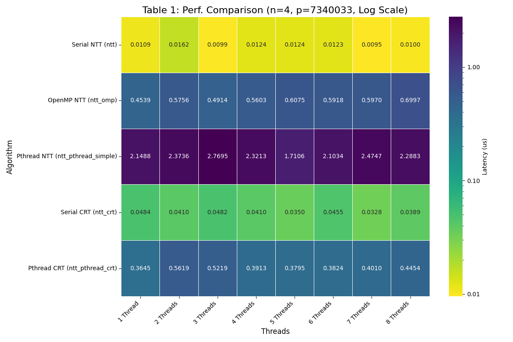
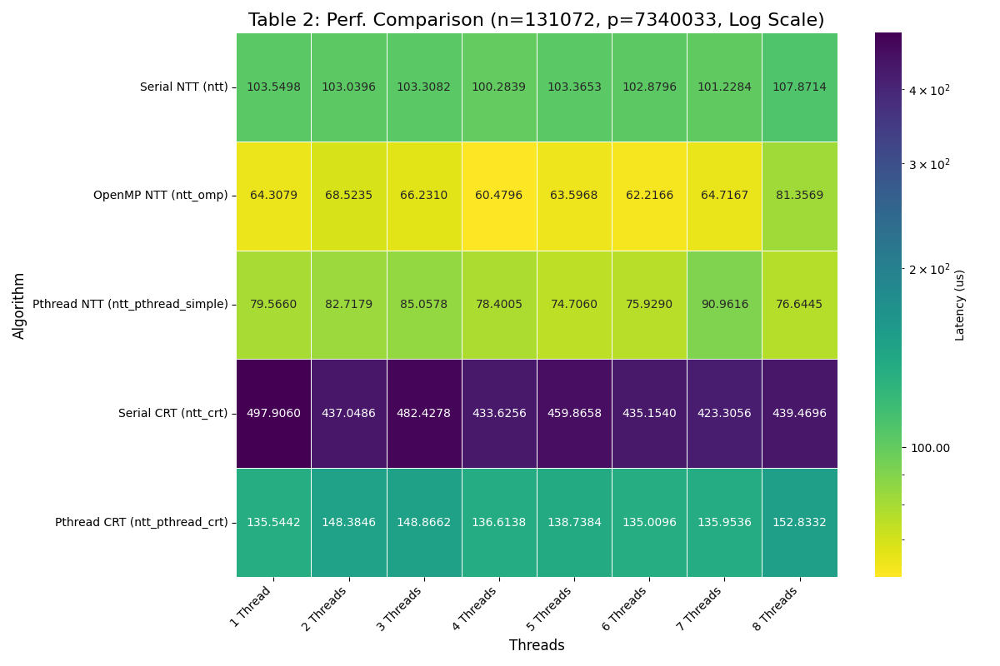
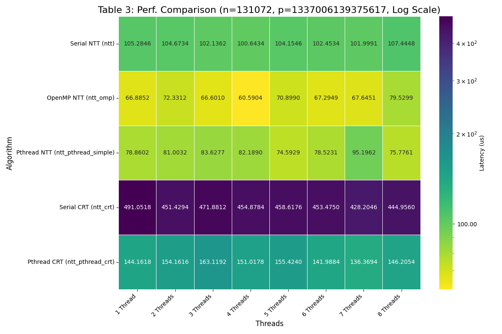

# 并行程序设计实验报告

> 基于 pthread 和 OpenMP 的 NTT 算法多线程优化

## 目录

- [并行程序设计实验报告](#并行程序设计实验报告)
  - [目录](#目录)
  - [前言](#前言)
  - [基于 OpenMP 的朴素算法多线程优化](#基于-openmp-的朴素算法多线程优化)
    - [对优化位点的理论分析](#对优化位点的理论分析)
    - [进行基于 OpenMP 的多线程并行化](#进行基于-openmp-的多线程并行化)
    - [初步的性能测试与分析](#初步的性能测试与分析)
  - [基于 pthread 的朴素算法多线程优化](#基于-pthread-的朴素算法多线程优化)
    - [实现线程池`ThreadPool`](#实现线程池threadpool)
      - [基本结构及其初始化](#基本结构及其初始化)
      - [任务队列](#任务队列)
      - [其它辅助方法](#其它辅助方法)
    - [使用线程池优化 NTT 算法](#使用线程池优化-ntt-算法)
    - [初步的性能测试](#初步的性能测试)
  - [CRT 优化算法的实现](#crt-优化算法的实现)
    - [基本原理](#基本原理)
    - [代码实现](#代码实现)
  - [基于 pthread 的 CRT 优化算法多线程优化](#基于-pthread-的-crt-优化算法多线程优化)
  - [分析与讨论](#分析与讨论)
    - [性能对比](#性能对比)
    - [问题：更改线程数对性能的影响较小](#问题更改线程数对性能的影响较小)
    - [profiling](#profiling)
      - [对比测试 OpenMP 和 Pthread 优化算法](#对比测试-openmp-和-pthread-优化算法)
    - [解释 CRT 合并的两种实现之间的性能差异](#解释-crt-合并的两种实现之间的性能差异)
      - [核心计算的重复次数](#核心计算的重复次数)
        - [`mod.inv`](#modinv)
        - [累积模数 `m` 的更新](#累积模数-m-的更新)
      - [内存访问模式](#内存访问模式)

## 前言

本次实验中，我将在已实现的基于 NTT 算法的多项式乘法代码的基础上，尝试进行多线程优化。

在此之前，我已经在上一次实验中实现了朴素的 NTT 算法以及使用 Montgomery 规约优化的 NTT 算法。本次实验我将选择使用 Montgomery 规约优化的 NTT 算法作为基准算法。

实验中，我将首先使用 OpenMP 和 pthread 在基准算法上进行多线程优化；随后，我将使用 CRT（中国剩余定理）对基准算法进行优化，并在优化后的算法的基础上使用 pthread 进行多线程优化。最后，我将先测试不同**问题规模**、不同**线程数**下的算法性能（串行和并行对比），随后就测试中观察到的现象进行分析，通过调试源码与查阅资料等方式解释线程数设置与实际性能无关的原因，并进一步通过 perf 工具进行**profiling**，以便进一步探究原因，同时讨论**Pthread 程序和 OpenMP 程序**的**性能差异**；在这之后，我将重点就 CRT 合并的两种实现之间的性能差异进行讨论，从**算法/编程策略**对性能的影响以及**体系结构相关优化**的角度论证这两个实现之间接近一倍的性能差异的成因。

本次实验的主要优化对象是`ntt_forward_mont`和`ntt_inverse_mont`两个函数。由于`ntt_forward_mont`和`ntt_inverse_mont`均由结构相似的三层`for`循环构成，本文将以`ntt_forward_mont`为例进行分析，`ntt_inverse_mont`的部分同理可知，因此略去不做展示。

## 基于 OpenMP 的朴素算法多线程优化

这一部分中，我将使用 OpenMP 在基准算法上进行多线程优化。

### 对优化位点的理论分析

`ntt_forward_mont` 函数的核心循环结构如下所示：

```cpp
// 第一层循环，记为 mid 循环
for (u32 mid = 1; mid < n; mid <<= 1)
{
    u32_mont Wn_mont = montMod.pow(omega_mont, (p - 1) / (mid << 1));
    // 第二层循环，记为 j 循环
    for (u32 j = 0; j < n; j += (mid << 1))
    {
        u32_mont w_mont = montMod.from_u32(1); // 为每个 j 块初始化 w_mont
        // 第三层循环，记为 k 循环
        for (u32 k = 0; k < mid; ++k, w_mont = montMod.mul(w_mont, Wn_mont))
        {
            u32_mont x_mont = a_mont[j + k];
            u32_mont y_mont = montMod.mul(w_mont, a_mont[j + k + mid]);
            a_mont[j + k] = montMod.add(x_mont, y_mont);
            a_mont[j + k + mid] = montMod.sub(x_mont, y_mont);
        }
    }
}
```

为了确认并行化位点，我们首先对这三层循环的多线程并行化潜力进行分析：

1. 外层 `mid` 循环：

   - 此循环控制 NTT 算法的计算阶段。每个阶段（`mid` 的一次迭代）都**依赖于**前一阶段对数组 `a_mont` 的完整更新结果。由于 `a_mont` 是**就地修改**的，当前 `mid` 值的计算**必须在**前一个 `mid` 值的计算**完成后**进行。
   - 由于这种迭代间的强数据依赖，`mid` 循环本身是**不适合直接多线程并行化**的，其执行必须是串行的。

2. 中间 `j` 循环：

   - 对于固定的 `mid` 值，`j` 循环以 `mid << 1` 为步长遍历数据块。在 `j` 循环的每次迭代中，所操作的 `a_mont` 数组的索引范围（例如，`j1` 对应的 `[j1, j1 + (mid << 1) - 1]` 和 `j2` 对应的 `[j2, j2 + (mid << 1) - 1]`）是**完全不重叠**的。旋转因子 `w_mont` 在每个 `j` 迭代开始时被分别初始化为 `montMod.from_u32(1)`。
   - 由于不同 `j` 迭代之间操作的数据区域**相互独立**，并且迭代内的状态（如 `w_mont`）被分别初始化，因此 `j` 循环的各个迭代是**数据独立**的，**非常适合多线程并行化**。
   - 若并行化 `j` 循环，每个线程将负责执行其内部的整个 `k` 循环，即进行 `mid` 次蝶形运算。应注意到，线程的任务量（也就是任务粒度）会随着 `mid` 的增加（即算法阶段的深入）而相应增大（并不会出现粒度过细的情况）。不过，对于确定的`mid`，各个线程的**任务量几乎相同**，它们会大致同时完成。
   - 注：此处还可以进一步进行若干讨论，例如线程数量、反复创建线程带来的性能损耗，等等。不过这里只是实现一个朴素版本，因此此处不做进一步讨论，而是留到[基于 OpenMP 的朴素算法多线程优化](#基于-openmp-的朴素算法多线程优化)这一节中进行统一分析。

3. 内层 `k` 循环

   - 在 `k` 循环内部，对 `a_mont[j + k]` 和 `a_mont[j + k + mid]` 的写操作，对于不同的 `k` 值，访问的是不同的内存单元，因此**不存在写冲突**。然而，旋转因子 `w_mont` 是通过 `w_mont = montMod.mul(w_mont, Wn_mont)` **迭代更新**的。这意味着第 `k` 次迭代所使用的 `w_mont` 值依赖于第 `k-1` 次迭代更新后的 `w_mont` 值，这构成了**循环携带依赖**。
   - 如果**简单地**在 `k` 循环前（即 L2 循环内部）应用并行化指令，会遇到 `w_mont` 的**依赖问题**。同时，在每个 `j` 的迭代中都创建和销毁线程组将导致巨大的并行开销。**不过**理论上，可以通过修改 `w_mont` 的计算方式来**解除此依赖**，例如在每个 `k` 迭代中独立计算 `w_mont_for_k = montMod.pow(Wn_mont, k)`（考虑到初始 `w_mont` 的值）。若**如此修改**，`k` 循环的迭代**便可独立执行**。
   - 即便在解决了 `w_mont` 的依赖后并行化 `k` 循环，每个并行任务也仅执行一次蝶形运算。这属于**非常细的任务粒度**。这会导致任务过度划分，降低整体性能。

综上，针对《2024 并行程序设计 Lab3_1_Pthread 编程-1.pdf》中提到的"显然可以对**第三层循环**进行多线程优化"，虽然理论上第三层循环在处理好 `w_mont` 的迭代依赖（例如通过为每个 `k` 重新计算 `(W_n)^k`）后可以并行，但这种做法存在任务粒度过细、并行开销高、实现难度大的问题。相比之下，并行化第二层循环（即 `j` 循环）任务粒度合适、并行管理开销较低、实现简洁。

因此，综合考虑数据依赖性、任务粒度、并行开销和实现复杂度，我们选择对**第二层** `for` 循环（`j` 循环）进行并行化。

### 进行基于 OpenMP 的多线程并行化

为了使用 OpenMP 对第二层 `for` 循环进行并行化，我们只需要在 `ntt_forward_mont` 函数中对应的 `j` 循环前添加 OpenMP 的并行化指导语句 `#pragma omp parallel for`（如前所述，`ntt_inverse_mont`同理）。这样，编译器会在运行时自动将循环迭代分配给多个线程执行。即：

```cpp
// ...
    for (u32 mid = 1; mid < n; mid <<= 1)
    {
        u32_mont Wn_mont = montMod.pow(omega_mont, (p - 1) / (mid << 1));
#pragma omp parallel for // 添加此行
        for (u32 j = 0; j < n; j += (mid << 1))
        {
            u32_mont w_mont = montMod.from_u32(1);
            for (u32 k = 0; k < mid; ++k, w_mont = montMod.mul(w_mont, Wn_mont))
            {
                // ... 运算主体 ...
            }
        }
    }
// ...
```

### 初步的性能测试与分析

在初步测试中，除了`4.in`因超过`u32`上限而失败以外，各测试样例均能正确通过。针对小规模问题(即`0.in`)和中大规模问题(即`1.in`，`2.in`和`3.in`)，测试结果有较大区别：

- 在小规模问题上，OpenMP 并行版本（即使是单线程）的平均执行时间远高于纯串行版本。串行执行时间约为 3 **微秒**，而单线程 OpenMP 平均耗时接近 2 **毫秒**，16 线程版本甚至达到平均 9 毫秒。这符合预期，即对于任务粒度极小的计算，并行化引入的额外开销（线程创建、管理、同步等）会超过并行执行本身带来的潜在收益。
- 在中大规模问题上，OpenMP 表现出了一定的**加速**效果。根据结果来看，大约从 2 个线程开始，平均执行时间相较于串行版本有所降低。例如，在`2.in`上，串行平均 111 毫秒，2 线程 OpenMP 平均约 99 毫秒，8 线程时平均约 71 毫秒。最佳加速效果大约出现在 4 至 12 个线程之间，具体取决于测试用例。然而，加速比并非随线程数线性增长，且在线程数较多（如 16 线程）时，部分测试用例性能**略有下降**。

我们将在报告的后续[分析与讨论](#分析与讨论)章节中，进一步设计测试方法，得到更全面的性能数据，从而进行更深入和系统的分析。

## 基于 pthread 的朴素算法多线程优化

这一部分中，我将使用 pthread 在基准算法上进行多线程优化。

我们的优化在上一节（[基于 OpenMP 的朴素算法多线程优化](#基于-openmp-的朴素算法多线程优化)）的基础上进行。经过分析，我们选择了中间 `j` 循环作为优化位点。然而，由于该层循环并非最外层循环，如果我们在中间 `j` 循环内（内层 `k` 循环外）创建线程，则会导致线程被反复创建与删除，大大降低加速效果。因此，在这一节中，我们将抛弃 OpenMP，使用 pthread 维护一个线程池，动态地向中间 `j` 循环分配线程。

### 实现线程池`ThreadPool`

首先，我们在`ntt/src/include/pthread_simple/thread_pool.h`中实现了一个线程池`ThreadPool`，用于统一创建和管理线程，以复用线程，避免在每次需要并行处理时反复创建和销毁线程带来的开销。其核心设计如下：

#### 基本结构及其初始化

`ThreadPool`类维护一个工作线程队列、一个任务队列以及必要的同步原语（互斥锁、条件变量）。

```cpp
// thread_pool.h (部分代码)
class ThreadPool {
public:
    explicit ThreadPool(size_t num_threads); // 根据指定线程数创建线程池
    ~ThreadPool();                           // 销毁线程池，停止并回收所有工作线程

    // 提交任务到任务队列，并返回一个 std::future 以获取任务结果
    template <typename Func, typename... Args>
    auto enqueue(Func &&f, Args &&...args) -> std::future<decltype(f(args...))>;

    void wait(); // 等待所有已提交的任务执行完毕

private:
    std::vector<std::thread> workers;          // 存储工作线程
    std::queue<std::function<void()>> tasks;   // 存储待执行的任务

    std::mutex queue_mutex;                    // 保护任务队列的互斥锁
    std::condition_variable condition;         // 用于通知工作线程有新任务或应停止
    std::atomic<bool> stop;                    // 标记线程池是否停止

    std::mutex wait_mutex;                     // 用于 wait() 功能的互斥锁
    std::condition_variable wait_condition;    // 用于 wait() 功能的条件变量
    std::atomic<int> active_tasks;             // 当前正在执行或待执行的任务数
};

// 构造函数实现概要
inline ThreadPool::ThreadPool(size_t num_threads) : stop(false), active_tasks(0) {
    for (size_t i = 0; i < num_threads; ++i) {
        workers.emplace_back([this]() { // 工作线程的执行逻辑
            while (true) {
                std::function<void()> task;
                {
                    std::unique_lock<std::mutex> lock(this->queue_mutex);
                    // 等待直到有任务或线程池停止
                    this->condition.wait(lock, [this]() { return this->stop || !this->tasks.empty(); });
                    if (this->stop && this->tasks.empty()) return; // 线程池停止且无任务则退出
                    task = std::move(this->tasks.front());
                    this->tasks.pop();
                    ++this->active_tasks; // 标记任务开始
                }
                task(); // 执行任务
                { // 任务完成后的处理
                    std::lock_guard<std::mutex> lock(this->wait_mutex);
                    if (--this->active_tasks == 0 && this->tasks.empty()) { // 如果所有任务完成
                        this->wait_condition.notify_all(); // 通知 wait() 方法
                    }
                }
            }
        });
    }
}
```

构造函数会创建指定数量的工作线程。每个工作线程在一个循环中运行：它首先尝试从任务队列中获取一个任务；如果队列为空，线程将等待（通过条件变量`condition`），直到被唤醒（有新任务加入或线程池停止）。

#### 任务队列

`enqueue`方法允许将一个可调用对象（如函数、lambda 表达式）及其参数封装成一个任务，并添加到任务队列中。它返回一个`std::future`对象，调用者可以通过它异步地获取任务的执行结果。

```cpp
// enqueue 方法实现概要
template <typename Func, typename... Args>
auto ThreadPool::enqueue(Func &&f, Args &&...args) -> std::future<decltype(f(args...))> {
    using return_type = decltype(f(args...));
    // 将任务封装为 std::packaged_task
    auto task_ptr = std::make_shared<std::packaged_task<return_type()>>(
        std::bind(std::forward<Func>(f), std::forward<Args>(args)...));
    {
        std::lock_guard<std::mutex> lock(queue_mutex);
        if (stop) throw std::runtime_error("enqueue on stopped ThreadPool");
        tasks.emplace([task_ptr]() { (*task_ptr)(); }); // 将 packaged_task 的执行体放入队列
    }
    condition.notify_one(); // 唤醒一个等待的工作线程
    return task_ptr->get_future();
}
```

#### 其它辅助方法

`wait()`方法允许主线程等待线程池中所有已提交的任务完成。析构函数`~ThreadPool()`会设置`stop`标志，唤醒所有工作线程，并等待它们执行完剩余任务后安全退出和销毁（通过`join`）。

### 使用线程池优化 NTT 算法

我们使用上述实现的`ThreadPool`来优化`ntt_forward_mont`和`ntt_inverse_mont`函数（在`pthread_simple`版本中命名为`ntt_forward_mont_pthread_simple`和`ntt_inverse_mont_pthread_simple`）。优化的核心思路与 OpenMP 版本类似，即并行化`j`循环，但线程管理由我们的线程池负责。

在早期，我们尝试了为`j`循环的每次迭代（即其中包含的`k`循环）都向线程池`enqueue`一个独立的任务，但是我们测得该方法的运行时间较长，例如在问题规模 `n = 131072` 时耗时约为 $23000 \mu s$，远远慢于串行版本的$100 \mu s$。经过分析我们发现，这种策略会导致**任务粒度过细**。具体而言，外层`mid`循环从 1 开始，当`mid`很小时（例如`mid=1`），内层`k`循环的迭代次数也为 1，这意味着每个任务只包含一次蝶形运算。当`n=131072`且`mid=1`时，`j`循环会迭代`n / (mid << 1) = 131072 / 2 = 65536`次，从而产生 65536 个极其细小的任务。这会导致巨大的线程调度开销、任务队列的频繁访问以及过多的同步操作，这些开销完全抵消了并行计算的潜在优势。

因此，我们转换思路，手动将 `j` 循环按照线程数进行均等划分为多个块，使得每个线程能一次性处理多个连续的迭代（`k`循环），从而增大任务粒度，降低并行化开销。

```cpp
// ntt/src/include/pthread_simple/transform.h (部分代码)
template <typename T>
inline void ntt_forward_mont_pthread_simple(T *a_mont, T n, T p, T omega_mont) {
    // ... 初始化 MontMod, num_threads ...
    ThreadPool pool(num_threads);

    for (T mid = 1; mid < n; mid <<= 1) { // 外层 mid 循环保持串行
        T_mont Wn_mont = montMod.pow(omega_mont, (p - 1) / (mid << 1));

        T total_blocks = n / (mid << 1); // j 循环迭代的总"块"数

        // 将 j 循环的块均匀分配给线程池中的线程
        for (size_t t = 0; t < num_threads; ++t) {
            T start_block = total_blocks * t / num_threads;
            T end_block = total_blocks * (t + 1) / num_threads;

            if (start_block < end_block) { // 确保有工作分配
                pool.enqueue([=, &montMod, a_mont]() { // 捕获必要的变量
                    for (T b = start_block; b < end_block; ++b) {
                        T j = b * (mid << 1);
                        T_mont w_mont = montMod.from_T(1);
                        for (T k = 0; k < mid; ++k, w_mont = montMod.mul(w_mont, Wn_mont)) {
                            T_mont x = a_mont[j + k];
                            T_mont y = montMod.mul(w_mont, a_mont[j + k + mid]);
                            a_mont[j + k] = montMod.add(x, y);
                            a_mont[j + k + mid] = montMod.sub(x, y);
                        }
                    }
                });
            }
        }
        pool.wait(); // 等待当前 mid 阶段的所有 j 循环块处理完毕
    }
}
```

在每个`ntt_forward_mont_pthread_simple`（或逆变换）函数的开始，我们创建一个`ThreadPool`实例，线程数设置为硬件支持的并发线程数 (`std::thread::hardware_concurrency()`)。`mid`循环的每一轮中，我们将`j`循环所覆盖的总数据块（`total_blocks`）平均分配给线程池中的`num_threads`个线程。每个线程负责处理一部分连续的块。每个任务（lambda 表达式）内部执行对应块范围内的`j`循环（外层）和完整的`k`循环（内层蝶形运算）。`pool.wait()`确保在一个`mid`阶段的所有并行任务完成后，才进入下一个`mid`阶段，这维持了`mid`循环之间的依赖关系。

### 初步的性能测试

初步测试结果显示，采用线程池和分块任务分配的 pthread 优化取得了显著的性能提升。在问题规模 `n = 131072` 时， `u32` 类型和 `u64` 类型下的运行时间分别在$60\mu s$和$80 \mu s$上下，低于单线程下的$75\mu s$和$100 \mu s$。对于`n=4`的小规模问题 ，pthread 版本的耗时在微秒级别（约 $2 \mu s$），比单线程下的十纳秒级别高了两个数量级。

同样地，我们将在报告的后续[分析与讨论](#分析与讨论)章节中，进一步在更全面的性能数据下，进行更深入和系统的分析。

## CRT 优化算法的实现

这一部分中，我将使用 CRT（中国剩余定理）对基准算法进行优化。

### 基本原理

在使用 NTT 进行多项式乘法时，若乘积多项式的系数可能非常大，以至于超过单个 NTT 模数 `p` 所能表示的范围（或者为了提高 NTT 的效率，选用的 `p` 较小），直接使用单一模数进行计算将导致结果错误。中国剩余定理（CRT）为此提供了一种解决方案，其核心思想是将一个大数上的计算分解为在多个较小的、互质的模数上进行计算，然后将这些结果合并以获得原始大数域上的解。

<!-- 或许这里可以加一下CRT的数学原理。 -->

在多项式乘法的背景下，这意味着：

1. 选择一组素数 `m_0, m_1, ..., m_{k-1}`，这些素数都适合进行 NTT（即 `m_i - 1` 具有足够大的 2 的幂次因子），并且它们的乘积 `M = m_0 * m_1 * ... * m_{k-1}` 必须大于多项式乘积结果的任何可能系数的最大值。
2. 对于每个模数 `m_i`，独立地计算多项式乘积 `C_i(x) = A(x) * B(x) (mod m_i)`。这通常通过对输入多项式 `A(x)` 和 `B(x)` 的系数分别取模 `m_i`，然后执行标准的 NTT 乘法完成。
3. 对于结果多项式的每一个系数，我们得到一组同余方程：
   `c_j ≡ c_{j,0} (mod m_0)`
   `c_j ≡ c_{j,1} (mod m_1)`
   `...`
   `c_j ≡ c_{j,k-1} (mod m_{k-1})`
   其中 `c_j` 是最终结果多项式第 `j` 个系数，`c_{j,i}` 是在模 `m_i` 下计算得到的第 `j` 个系数。
4. 使用 CRT 从 `c_{j,0}, c_{j,1}, ..., c_{j,k-1}` 解出 `c_j (mod M)`。

### 代码实现

在项目 `ntt/src/include/CRT/ntt.h` 文件中，我们实现了基于 CRT 的 NTT 多项式乘法。

首先，定义了一组预选的 NTT 友好素数 `CRT_MODS` 及其对应的原根 `CRT_ROOTS`：

```cpp
static const u64 CRT_MODS[] = {998244353, 1004535809, 469762049, 167772161};
static const u64 CRT_ROOTS[] = {3, 3, 3, 3};
static const u64 CRT_NUMS = sizeof(CRT_MODS) / sizeof(CRT_MODS[0]);
```

这些模数都小于 `2^30`，适合 `u64` 计算，并且它们的乘积远大于常见的 `u64` 范围，可以表示非常大的系数。

核心函数 `poly_multiply_ntt_crt` 负责整个流程：

```cpp
inline void poly_multiply_ntt_crt(u64 *a, u64 *b, u64 *ab, u64 n, u64 p)
{
    u64 n_expanded = expand_n(2 * n - 1); // 确定NTT运算的长度

    u64 **ab_crt = new u64 *[CRT_NUMS];    // 存储每个模数下的NTT结果
    u128 *ab_u128 = new u128[n_expanded]; // 存储CRT合并后的结果 (使用u128防止溢出)

    // 1. 对每个CRT模数执行标准NTT多项式乘法
    for (u64 i = 0; i < CRT_NUMS; i++)
    {
        ab_crt[i] = new u64[n_expanded]{};
        // poly_multiply_ntt 对 a 和 b 的系数模 CRT_MODS[i] 后进行NTT乘法
        poly_multiply_ntt(a, b, ab_crt[i], n, CRT_MODS[i], CRT_ROOTS[i]);
    }

    // 初始化合并结果，以第一个模数下的结果为基础
    for (u64 i = 0; i < n_expanded; ++i)
        ab_u128[i] = ab_crt[0][i];

    // 2. 使用CRT合并结果
    CRT_combine(ab_u128, ab_crt, n_expanded);
    // 或者 CRT_combine_2(ab_u128, ab_crt, n_expanded);

    // 3. 将合并后的大数结果对最终模数 p 取模
    for (u64 i = 0; i < n_expanded; ++i)
        ab[i] = ab_u128[i] % p;

    // 内存回收
    delete[] ab_u128;
    for (u64 i = 0; i < CRT_NUMS; ++i)
        delete[] ab_crt[i];
    delete[] ab_crt;
}
```

该函数首先对选定的每个 `CRT_MODS[i]` 执行一次标准的多项式乘法 `poly_multiply_ntt`，并将结果存储在 `ab_crt[i]` 中。随后，调用 `CRT_combine` (或 `CRT_combine_2`) 函数，依据中国剩余定理，将这些部分结果合并到 `ab_u128` 数组中（使用 `u128` 类型以容纳可能的大数值）。最后，将合并后的结果对目标模数 `p` 取模，得到最终的多项式系数。

代码中实现了两种 CRT 合并算法：`CRT_combine` 和 `CRT_combine_2`。
`CRT_combine` 的实现方式如下（一种迭代式的 Garner's algorithm 的变体）：

```cpp
// 将 ab_crt 的 CRT 结果合并到 ab 中 (ab 初始化为 ab_crt[0])
inline void CRT_combine(u128 *ab, u64 **ab_crt, u64 n)
{
    u128 m = CRT_MODS[0]; // 当前已经合并的模数的乘积
    for (u64 i = 1; i < CRT_NUMS; ++i) // 从第二个模数开始迭代
    {
        u64 CRT_MOD = CRT_MODS[i]; // 当前要合并的模数
        Mod128 mod(CRT_MOD);       // 用于在 CRT_MOD 下进行运算的模运算类

        // 计算 m 在模 CRT_MOD 下的逆元：inv(m) mod CRT_MOD
        u128 inv = mod.inv(m % CRT_MOD);
        for (u64 j = 0; j < n; j++) // 对每个系数进行合并
        {
            u128 x = ab[j]; // 当前已经合并的结果 x = k_0 (mod m_0*...*m_{i-1})
            // t = (ab_crt[i][j] - (x % CRT_MOD)) * inv(m) (mod CRT_MOD)
            // t 是满足 (x + m*t) === ab_crt[i][j] (mod CRT_MOD) 的最小非负整数
            u64 t = mod.sub(ab_crt[i][j], x % CRT_MOD);
            t = mod.mul(t, inv);

            // 更新合并结果：x_new = x + m * t
            // 此时 x_new 满足 x_new === k_0 (mod m_0*...*m_{i-1})
            // 且 x_new === ab_crt[i][j] (mod CRT_MOD)
            x = x + m * t;
            ab[j] = x;
        }
        m *= CRT_MOD; // 更新已合并模数的乘积
    }
}
```

此方法逐个引入新的模数，并更新当前已合并的解。对于每个系数 `ab[j]`，它首先保存了模 `m_0 * ... * m_{i-1}` 的解，然后通过计算一个调整项 `t`，使得新的解也满足模 `m_i` 的同余条件。

`CRT_combine_2` 实现了另一种合并方式，它对每个系数独立地从头开始构建 CRT 解：

```cpp
inline void CRT_combine_2(u128 *ab, u64 **ab_crt, u64 n)
{
    for (u64 i = 0; i < n; ++i) // 对每个系数独立计算
    {
        u128 x = ab_crt[0][i]; // 从第一个模数的结果开始
        u128 m = CRT_MODS[0];

        for (u64 j = 1; j < CRT_NUMS; ++j) // 逐个引入其他模数的结果
        {
            u64 CRT_MOD = CRT_MODS[j];
            Mod128 mod(CRT_MOD);

            // t = (ab_crt[j][i] - (x % CRT_MOD)) * inv(m % CRT_MOD) (mod CRT_MOD)
            u64 t = mod.sub(ab_crt[j][i], x % CRT_MOD);
            u64 inv = mod.inv(m % CRT_MOD);
            t = mod.mul(t, inv);

            x = x + m * t; // 更新解
            m *= CRT_MOD;  // 更新模数乘积
        }
        ab[i] = x; // 存储当前系数的最终CRT解
    }
}
```

我们分别对两个 CRT 算法在第 0 到第 4 个测试样例上进行初步的正确性测试和性能测试。初步结果显示，两个算法均可以正确解决这 5 个测试样例，证明算法在`uint64`的数据宽度下也可以正常工作； `CRT_combine` 在处理 `n = 131072` 规模的问题时，耗时约 **440-450** 微秒，而 `CRT_combine_2` 耗时约 **900-910** 微秒。这表明迭代更新当前解的 `CRT_combine` 方法可能具有**更好的缓存局部性**或**更少的重复计算**（例如模逆元的计算 `mod.inv(m % CRT_MOD)` 中，`m` 在 `CRT_combine` 的外层循环中，而 `CRT_combine_2` 中 `m` 在内层循环变化，但 `mod.inv` 每次都针对新的 `m % CRT_MOD` 进行计算）。我们将在[分析与讨论](#分析与讨论)一节中对该现象的成因进行分析。

引入这一 CRT 优化算法后，我们可以处理更大系数的多项式乘法。我们将在接下来的[基于 pthread 的 CRT 优化算法多线程优化](#基于-pthread-的-crt-优化算法多线程优化)一节中对这一算法进行并行化。

<!--
注：使用第一个CRT算法的结果如下：

多项式乘法结果正确
average latency for n = 4 p = 7340033 : 0.03446 (us)
多项式乘法结果正确
average latency for n = 131072 p = 7340033 : 446.686 (us)
多项式乘法结果正确
average latency for n = 131072 p = 104857601 : 442.015 (us)
多项式乘法结果正确
average latency for n = 131072 p = 469762049 : 441.801 (us)
多项式乘法结果正确
average latency for n = 131072 p = 1337006139375617 : 448.786 (us)

使用第二个CRT算法的结果如下：

多项式乘法结果正确
average latency for n = 4 p = 7340033 : 0.04449 (us)
多项式乘法结果正确
average latency for n = 131072 p = 7340033 : 905.087 (us)
多项式乘法结果正确
average latency for n = 131072 p = 104857601 : 905.88 (us)
多项式乘法结果正确
average latency for n = 131072 p = 469762049 : 900.773 (us)
多项式乘法结果正确
average latency for n = 131072 p = 1337006139375617 : 910.255 (us)

我们可以在这里简单提一下，并在分析与讨论中的"2. "或者"6. "下进行讨论。
 -->

## 基于 pthread 的 CRT 优化算法多线程优化

这一部分中，我将在优化后的算法的基础上使用 pthread 进行多线程优化。

由于我们的模数数量固定为 4 个，我们可以简单地把四次多项式乘法分配给四个线程。此时线程划分次数少，每个线程的任务量几乎一致，且创建线程次数少，因此没必要使用线程池，直接为四个多项式乘法分配四个线程即可。

我们主要修改了 `poly_multiply_ntt_crt` 函数（在 pthread 实现中更名为 `poly_multiply_ntt_pthread_crt`），并引入了辅助的数据结构和线程工作函数。其核心思路是将针对 `CRT_NUMS`（固定为 4）个不同模数的 `poly_multiply_ntt` 调用分配给不同的线程并行执行。

我们定义了一个结构体 `PthreadNttArgs`，用于封装传递给每个线程的独立参数。

```cpp
// Structure to pass arguments to each NTT worker thread
struct PthreadNttArgs
{
    u64 *a_poly;          // Pointer to the first input polynomial
    u64 *b_poly;          // Pointer to the second input polynomial
    u64 *result_poly_crt; // Pointer to the output array for this thread (a part of ab_crt)
    u64 n_poly_len;       // Original length of the polynomials
    u64 current_mod;      // The CRT modulus for this thread
    u64 current_root;     // The primitive root for the current_mod
};
```

每个被创建的线程将执行 `poly_multiply_ntt_thread_worker` 函数。此函数从传入的参数中解析出所需数据，并调用标准的 `poly_multiply_ntt` 函数完成特定模数下的多项式乘法。

```cpp
// Thread worker function: performs poly_multiply_ntt for a single CRT modulus
static void *poly_multiply_ntt_thread_worker(void *arg)
{
    PthreadNttArgs *params = (PthreadNttArgs *)arg;
    poly_multiply_ntt(params->a_poly, params->b_poly, params->result_poly_crt,
                        params->n_poly_len, params->current_mod, params->current_root);
    return NULL;
}
```

在主函数 `poly_multiply_ntt_pthread_crt` 中，我们首先为每个模数的结果数组分配内存。然后，创建 `CRT_NUMS` 个线程，每个线程配置其独立的 `PthreadNttArgs`。通过 `pthread_create` 启动这些线程后，主线程通过 `pthread_join` 等待所有子线程完成计算。

```cpp
inline void poly_multiply_ntt_pthread_crt(u64 *a, u64 *b, u64 *ab, u64 n, u64 p)
{
    u64 n_expanded = expand_n(2 * n - 1);

    u64 **ab_crt = new u64 *[CRT_NUMS];
    u128 *ab_u128 = new u128[n_expanded];

    // Step 1: Allocate memory for each CRT result array (serially)
    for (u64 i = 0; i < CRT_NUMS; i++)
    {
        ab_crt[i] = new u64[n_expanded]{};
    }

    pthread_t threads[CRT_NUMS];
    PthreadNttArgs thread_args[CRT_NUMS];

    // Step 2: Create and launch threads to perform NTT for each modulus in parallel
    for (u64 i = 0; i < CRT_NUMS; i++)
    {
        thread_args[i].a_poly = a;
        thread_args[i].b_poly = b;
        thread_args[i].result_poly_crt = ab_crt[i];
        thread_args[i].n_poly_len = n;
        thread_args[i].current_mod = CRT_MODS[i];
        thread_args[i].current_root = CRT_ROOTS[i];

        pthread_create(&threads[i], NULL, poly_multiply_ntt_thread_worker, (void *)&thread_args[i]);
    }

    // Step 3: Wait for all threads to complete their execution
    for (u64 i = 0; i < CRT_NUMS; i++)
    {
        pthread_join(threads[i], NULL);
    }

    // Initialize ab_u128 with results from the first modulus
    for (u64 i = 0; i < n_expanded; ++i)
        ab_u128[i] = ab_crt[0][i];

    // Combine results using CRT
    CRT_combine(ab_u128, ab_crt, n_expanded);

    // Final modular reduction
    for (u64 i = 0; i < n_expanded; ++i)
        ab[i] = ab_u128[i] % p;

    // Memory cleanup
    delete[] ab_u128;
    for (u64 i = 0; i < CRT_NUMS; ++i)
        delete[] ab_crt[i];
    delete[] ab_crt;
}
```

我们在`./test.sh 2 1 1`和`./test.sh 2 4 4`下分别 pthread 优化后的 CRT 进行初步的正确性测试和性能测试。初步结果显示，优化后的代码可以正确解决这 5 个测试样例，证明算法在 pthread 优化后也可以正常工作；二者对规模为`n = 131072`的样例的处理时长均从未优化时的$440 \mu s$变为$140 \mu s$左右，一方面证明 pthread 优化确实有效，另一方面似乎表明`test.sh`里设置的核心数和线程数似乎与程序实际使用的线程数无关。

<!--
测试结果：

在./test.sh 2 1 1（2表示测试pthread，1表示申请1个核心，1表示申请1个线程）下，结果如下：

多项式乘法结果正确
average latency for n = 4 p = 7340033 : 0.327471 (us)
多项式乘法结果正确
average latency for n = 131072 p = 7340033 : 140.988 (us)
多项式乘法结果正确
average latency for n = 131072 p = 104857601 : 141.119 (us)
多项式乘法结果正确
average latency for n = 131072 p = 469762049 : 141.79 (us)
多项式乘法结果正确
average latency for n = 131072 p = 1337006139375617 : 145.227 (us)

然而，在./test.sh 2 4 4下仍然差不多是以上结果。
 -->

## 分析与讨论

这一部分中，我将尝试从以下角度进行以下分析：

1. 测试不同**问题规模**、不同**线程数**下的算法性能（串行和并行对比）
2. 就测试中观察到的现象进行分析，包括：
   1. 通过调试源码与查阅资料等方式解释线程数设置与实际性能无关的原因
   2. 通过 perf 工具进行**profiling**，以便进一步探究原因
3. 利用**profiling**结果，讨论**Pthread 程序和 OpenMP 程序**的**性能差异**
4. 就 CRT 合并的两种实现之间的性能差异进行讨论，从**算法/编程策略**对性能的影响以及**体系结构相关优化**的角度论证这两个实现之间接近一倍的性能差异的成因。

### 性能对比

在这一部分，我们将统一测试并展示不同**问题规模**、不同**数据类型**和不同**线程数**下的算法运行延迟，随后计算各个优化算法的加速比。

首先，我们在服务器上对串行 ntt、OpenMP 优化的 ntt、Pthread 优化的 ntt、串行 CRT 和 Pthread 优化的 CRT 分别在五个测试点下进行了五轮测试并取平均值。随后，我们分别在小规模数据（`n=4, p=7340033`）、大规模数据（`n=131072, p=7340033`）和大模数（`n=131072, p=1337006139375617`）三个情形下绘制了热力图，直观对比这五个算法的延迟。三个情形下的图片分别为：





<!-- #### 表 1：性能对比 (n=4, p=7340033, 时间单位: µs)

| 算法                              | 1 线程  | 2 线程  | 3 线程  | 4 线程  | 5 线程  | 6 线程  | 7 线程  | 8 线程  |
| :-------------------------------- | :------ | :------ | :------ | :------ | :------ | :------ | :------ | :------ |
| 串行基准 (ntt)                    | 0.01090 | 0.01617 | 0.00991 | 0.01243 | 0.01238 | 0.01231 | 0.00954 | 0.01004 |
| 串行 CRT (ntt_crt)                | 0.04838 | 0.04095 | 0.04821 | 0.04104 | 0.03496 | 0.04553 | 0.03285 | 0.03885 |
| OpenMP 朴素 (ntt_omp)             | 0.45392 | 0.57563 | 0.49135 | 0.56029 | 0.60749 | 0.59183 | 0.59701 | 0.69967 |
| Pthread 朴素 (ntt_pthread_simple) | 2.14885 | 2.37356 | 2.76954 | 2.32126 | 1.71056 | 2.10344 | 2.47469 | 2.28835 |
| Pthread CRT (ntt_pthread_crt)     | 0.36451 | 0.56194 | 0.52188 | 0.39127 | 0.37955 | 0.38240 | 0.40103 | 0.44538 |

#### 表 2：性能对比 (n=131072, p=7340033, 时间单位: µs)

| 算法                              | 1 线程    | 2 线程    | 3 线程    | 4 线程    | 5 线程    | 6 线程    | 7 线程    | 8 线程    |
| :-------------------------------- | :-------- | :-------- | :-------- | :-------- | :-------- | :-------- | :-------- | :-------- |
| 串行基准 (ntt)                    | 103.54980 | 103.03960 | 103.30820 | 100.28386 | 103.36532 | 102.87960 | 101.22844 | 107.87140 |
| 串行 CRT (ntt_crt)                | 497.90600 | 437.04860 | 482.42780 | 433.62560 | 459.86580 | 435.15400 | 423.30560 | 439.46960 |
| OpenMP 朴素 (ntt_omp)             | 64.30792  | 68.52346  | 66.23100  | 60.47960  | 63.59682  | 62.21660  | 64.71670  | 81.35690  |
| Pthread 朴素 (ntt_pthread_simple) | 79.56596  | 82.71794  | 85.05776  | 78.40050  | 74.70602  | 75.92900  | 90.96156  | 76.64454  |
| Pthread CRT (ntt_pthread_crt)     | 135.54420 | 148.38460 | 148.86620 | 136.61380 | 138.73840 | 135.00960 | 135.95360 | 152.83320 |

#### 表 3：性能对比 (n=131072, p=1337006139375617, 时间单位: µs)

| 算法                              | 1 线程    | 2 线程    | 3 线程    | 4 线程    | 5 线程    | 6 线程    | 7 线程    | 8 线程    |
| :-------------------------------- | :-------- | :-------- | :-------- | :-------- | :-------- | :-------- | :-------- | :-------- |
| 串行基准 (ntt)                    | 105.28460 | 104.67340 | 102.13620 | 100.64342 | 104.15460 | 102.45340 | 101.99914 | 107.44480 |
| 串行 CRT (ntt_crt)                | 491.05180 | 451.42940 | 471.88120 | 454.87840 | 458.61760 | 453.47500 | 428.20460 | 444.95600 |
| OpenMP 朴素 (ntt_omp)             | 66.88516  | 72.33118  | 66.60100  | 60.59044  | 70.89900  | 67.29490  | 67.64510  | 79.52992  |
| Pthread 朴素 (ntt_pthread_simple) | 78.86022  | 81.00318  | 83.62770  | 82.18902  | 74.59294  | 78.52310  | 95.19616  | 75.77608  |
| Pthread CRT (ntt_pthread_crt)     | 144.16180 | 154.16160 | 163.11920 | 151.01780 | 155.42400 | 141.98840 | 136.36940 | 146.20540 | -->

根据图片，纵向来看（对比同一线程、不同算法），我们可以看出：

1. 在小规模数据下，多线程均起到了程度不等的**负优化**效果。其中，相比于串行 ntt，OpenMP 优化的 ntt 和 Pthread 优化的 ntt 分别起到了约 -97.60% 和 -99.49%的优化效果（注：A 相对于 B 的优化效果等于$(v_A-v_B)/v_B$，这等于$(t_B-t_A)/t_A$）；相比于串行 CRT，Pthread 优化的 CRT 起到了约 -86.73%的优化效果。同时，我们观察到串行 CRT 的延迟是串行 ntt 的约 4.44 倍，接近 4 倍。
2. 在大规模数据下，多线程均起到了程度不等的**正优化**效果。其中，相比于串行 ntt，OpenMP 优化的 ntt 和 Pthread 优化的 ntt 分别起到了约 61.0% 和 30.1%的优化效果；相比于串行 CRT，Pthread 优化的 CRT 起到了约 267.3%的优化效果。与小规模数据相似，我们观察到串行 CRT 的延迟是串行 ntt 的约 4.81 倍，这也接近 4 倍。
3. 在大模数下，测试结果与大规模数据几乎完全一致，这说明算法性能只与数据规模有关而与模数大小无关。

除此以外，我们特别关注 OpenMP 优化的 ntt 和 Pthread 优化的 ntt 这两个算法之间的性能对比。我们发现：

1. 在小规模数据下，OpenMP 优化的 ntt 明显优于 Pthread 优化的 ntt，后者的运行时间是前者的约 4.73 倍。
2. 在大规模数据下，OpenMP 优化的 ntt 在大多数线程数下（即除了 8 线程以外的线程数）都优于 Pthread 优化的 ntt，但二者的运行时间相差不多，后者的运行时间仅有前者的约 1.24 倍。

我们将在接下来的 profiling 中详细剖析 OpenMP 优化优于 Pthread 优化的原因。

以上是我们得到的平凡结论。然而，从该图片中也能得到不平凡的结论，该结论是横向观察（对比不同线程、同一算法）得到的：

整体上来说，尤其是对于小规模数据而言，更改线程数对性能的影响并不大。事实上，在`n=4`的规模下，该算法在每个外层`mid`循环中只需要进行 4 次蝶形运算，这种规模下进行多线程优化本身便意义不大，更不用说更改线程数了。然而，在`n=131072`下，我们惊讶地发现，更改线程数对性能的影响依然不大。

接下来，我们将讨论这一问题。

### 问题：更改线程数对性能的影响较小

由于 OpenMP 使用自动优化、不易进行调试寻找答案，我们首先从 Pthread 入手进行探索。经过调试与定位，我们发现了问题所在。

在我们的 Pthread 实现中，我们使用如下代码进行自动线程数分配：

```cpp
size_t num_threads = std::thread::hardware_concurrency();
if (num_threads == 0)
    num_threads = 1;
ThreadPool pool(num_threads);
```

这段代码会自动根据`std::thread::hardware_concurrency()` 返回的硬件并发线程数（通常是系统的逻辑核心数）来初始化线程池大小。

理论上来说，当我们使用`bash test.sh 2 4 4`运行提交脚本，为程序分配 4 核 4 线程时，此处的`num_threads`应该是 4。然而，实际调试时我们发现，**无论我们为程序分配多少核、多少线程**，`num_threads`始终**固定为 8**。

我们尝试查找资料分析原因。经过探索，我们认为，`std::thread::hardware_concurrency()` 返回的是系统物理或虚拟机层面**可用**的总逻辑核心数，它通常不感知或不受 `test.sh` 脚本对当前进程施加的 CPU 核心数限制。因此，即使脚本尝试将程序限制在例如 4 个核心上，如果机器本身拥有 8 个逻辑核心，`hardware_concurrency()` 仍可能报告 8。

同理，我们怀疑 OpenMP 也是出于同样的原因才使得更改线程数对性能的影响较小。为了佐证我们的猜想，我们查找资料了解 OpenMP 的运行方式。我们发现，如果未通过 `OMP_NUM_THREADS` 环境变量或库函数（如 `omp_set_num_threads()`）显式设置线程数，OpenMP 运行时库通常会默认使用其检测到的系统所有可用逻辑核心（例如通过 `omp_get_num_procs()` 查询）。这种检测方式与 `std::thread::hardware_concurrency()` 类似，也不考虑外部脚本施加的 CPU 资源限制，从而导致即使在不同 `test.sh` 配置下，程序实际使用的线程数是一致的。

补充：我们在与同学交流的时候获知，`bash test.sh 2 4 4`里的“4 线程”指的是“**最低**分配 4 个线程”，而非“**固定**分配 4 个线程”。也就是说，如果计算集群此时有超过 4 个线程可用，`std::thread::hardware_concurrency()`仍会尝试获取尽可能多的可用线程数。这解释了 num_threads`始终固定为 8 的原因。

### profiling

我们在这一节重点使用 perf 测试`poly_multiply_ntt_pthread_simple`和`poly_multiply_ntt_omp`这两个函数的 CPI、Cache 命中率，以及总执行时间。随后，我们尝试了绘制这两个函数以及`poly_multiply_ntt_pthread_crt`的火焰图，但是经过探索，我们发现只能绘制出提交脚本的火焰图，无法得到我们程序的火焰图。因此，我们本次实验将跳过火焰图部分。

#### 对比测试 OpenMP 和 Pthread 优化算法

正如在 [问题：更改线程数对性能的影响较小](#问题更改线程数对性能的影响较小) 一节中讨论的，我们发现测试脚本中设置的线程数并未严格限制程序实际使用的线程数，两者（Pthread 和 OpenMP 版本）在我们的测试环境下均倾向于使用全部 8 个可用核心。因此，我们针对不同的 `test.sh` 核心/线程数配置（5、6、7、8）执行了多次测试，并将这些测试视为重复实验，对其性能计数器结果取平均值，以获得更稳健的性能画像。

经过数据整理和平均后，我们得到 `poly_multiply_ntt_pthread_simple` (基于我们实现的线程池) 和 `poly_multiply_ntt_omp` (基于 OpenMP) 在处理大规模数据（例如 `n=131072`）时的平均性能指标如下表所示：

| 性能指标           | `poly_multiply_ntt_pthread_simple` | `poly_multiply_ntt_omp` | 单位   |
| :----------------- | :--------------------------------- | :---------------------- | :----- |
| 平均 CPU 周期数    | 28,450,050                         | 28,957,216              | cycles |
| 平均指令数         | 27,310,929                         | 27,314,484              | count  |
| 平均 IPC           | 0.960                              | 0.943                   |        |
| 平均缓存访问数     | 10,326,410                         | 10,323,020              | count  |
| 平均缓存未命中数   | 98,273                             | 97,373                  | count  |
| 平均缓存未命中率   | 0.9517%                            | 0.9433%                 | %      |
| 平均用户态执行时间 | 0.02937                            | 0.02573                 | 秒     |

从这些数据中，我们可以得到以下结论：

1. OpenMP 版本的**平均用户态执行时间** (约 0.0257 秒) 明显**低于** Pthread 版本 (约 0.0294 秒)。这直接反映了在并行计算部分，OpenMP 实现的实际运行速度更快，其用户态耗时约为 Pthread 版本的 87.6%。
2. Pthread 版本的**平均 CPU 周期数**略少 (约 28.45M vs 28.96M for OMP)，并且其**平均 IPC** 略高 (0.960 vs 0.943 for OMP)。这意味着 Pthread 版本中 CPU 在执行指令时的微观效率（不考虑并行管理开销）稍占优势。不过，鉴于该优势较小，我们认为这并不是主要因素。
3. 至于缓存、指令数，两个版本的**总指令数和缓存总访问次数非常接近**，不是二者性能差异的原因。

综合分析这些指标，我们认为，尽管 Pthread 版本在 IPC 和周期数这些微观指令执行效率指标上表现略优，但其最终的**用户态执行时间**却长于 OpenMP 版本。

我们推测其原因主要在于：我们自定义的 `ThreadPool` (用于 `poly_multiply_ntt_pthread_simple`) 虽然实现了任务分块以增大粒度，但其任务提交 (`enqueue`)、线程间的同步（通过互斥锁、条件变量管理任务队列和活跃任务计数）、`std::function` 对象的封装及调用、以及 `pool.wait()` 所需的同步机制，相对于 OpenMP 的开销更大。在之前查阅资料时我们得知，OpenMP 的 `#pragma omp parallel for` 指令通常由编译器进行深度优化，开销较低。

这些 `perf` 分析结果与我们在 [性能对比](#性能对比) 章节中观察到的现象基本一致：即在大规模问题上，OpenMP 优化版本通常比我们基于自定义线程池的 Pthread 优化版本具有更好的实际运行性能。

### 解释 CRT 合并的两种实现之间的性能差异

在这一部分，我们从多个角度分析并解释 CRT 合并的两种实现之间的性能差异，包括 cache 优化、算法策略等等。

在对基于 CRT 的 NTT 算法进行实现时，我们给出了两种 CRT 结果合并函数：`CRT_combine` 和 `CRT_combine_2`。初步性能测试表明，`CRT_combine`（对于 `n=131072` 规模问题耗时约 440-450 µs）显著快于 `CRT_combine_2`（耗时约 900-910 µs）。

我们的分析表明，这种性能差异主要源于以下两个方面：

1. 从**算法/编程策略**的角度讲，`CRT_combine_2` 的算法设计导致了对高开销操作（特别是模逆元运算和累积模数 `m` 的更新）的大量重复计算。`CRT_combine` 通过迭代方式，在合并过程中逐步累积当前解和模数乘积，并有效复用了模逆元等中间计算结果，从而实现了高得多的运算效率。这是主要原因。
2. 从**体系结构相关优化**的角度来看，`CRT_combine` 采用的内存访问模式具有**更好的缓存局部性**，这也贡献了一部分性能优势，但我们认为其影响程度小于计算冗余带来的差异。

以下是对这两个原因的详细论述。

#### 核心计算的重复次数

两种算法最本质的差异在于对一些高开销计算的重复执行次数，包括`mod.inv`以及累积模数 `m` 的更新。

##### `mod.inv`

在 `CRT_combine` 中，模逆元 `inv = mod.inv(m % CRT_MOD)` 的计算位于外层循环（针对每个新的模数 `CRT_MODS[i]`）。由于总共有 `CRT_NUMS` 个模数，此运算总共执行 `CRT_NUMS - 1` 次。

在 `CRT_combine_2` 中，模逆元 `inv` 的计算位于针对每个系数 `ab[i]` 的外层循环内部的第二层循环（针对每个新的模数 `CRT_MODS[j]`）。因此，此运算总共执行 `n * (CRT_NUMS - 1)` 次。

以 `n = 131072` 且 `CRT_NUMS = 4` (固定的模数个数) 为例，`CRT_combine` 仅执行 3 次模逆元运算，而 `CRT_combine_2` 则执行 `131072 * 3 = 393216` 次。模逆元通常通过扩展欧几里得算法等方法计算，其计算复杂度远高于基本的模加、模减和模乘运算。这数十万次的额外高开销运算是 `CRT_combine_2` 性能远逊于 `CRT_combine` 的最主要原因。

##### 累积模数 `m` 的更新

在`CRT_combine` 中，当前已合并模数的乘积 `m` 在外层循环中逐步累积，`m *= CRT_MOD` 操作（`u128` 精度乘法）执行 `CRT_NUMS - 1` 次。

`CRT_combine_2` 中，对于每一个系数，`m` 都会从 `CRT_MODS[0]` 开始重新计算并累积。这意味着 `m` 的初始化 (`m = CRT_MODS[0]`) 执行 `n` 次，而 `m *= CRT_MOD` 操作执行 `n * (CRT_NUMS - 1)` 次。同样，这造成了大量的 `u128` 乘法冗余。

#### 内存访问模式

在 `CRT_combine` 中，内层循环 `for (u64 j = 0; j < n; j++)` 对系数进行遍历。在一次外层循环（固定 `i`，即固定当前模数 `CRT_MODS[i]`）中，它顺序读取 `ab_crt[i][j]` (即 `ab_crt[i]` 数组的元素)，并顺序读写 `ab[j]` (合并结果数组的元素)。这种连续的、线性的内存访问模式具有良好的空间局部性，非常有利于缓存的命中率。

而在 `CRT_combine_2` 中，外层循环 `for (u64 i = 0; i < n; ++i)` 对系数进行遍历。对于每个系数 `ab[i]`，其内层循环 `for (u64 j = 1; j < CRT_NUMS; ++j)` 需要依次访问 `ab_crt[0][i]`, `ab_crt[1][i]`, ..., `ab_crt[CRT_NUMS-1][i]`。由于 `ab_crt` 是一个指针数组 (`u64 **ab_crt`)，其中每个 `ab_crt[k]` 指向一个独立分配的内存块。因此，`ab_crt[0][i]` 和 `ab_crt[1][i]` 在物理内存上是不连续的。当处理系数 `i` 时，`CRT_combine_2` 需要在 `CRT_NUMS` 个不同的内存区域中读取数据（`ab_crt[0]+i`, `ab_crt[1]+i`, ...）。这种跨多个数组的“列式”访问模式，相较于 `CRT_combine` 中对单个 `ab_crt[k]` 数组的“行式”扫描，更容易导致缓存冲突和未命中，尤其是在 `n` 较大，各个 `ab_crt[k]` 数组无法同时完全载入缓存时。
