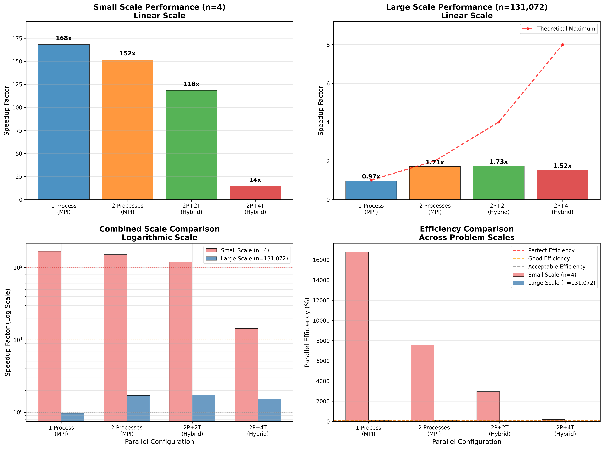
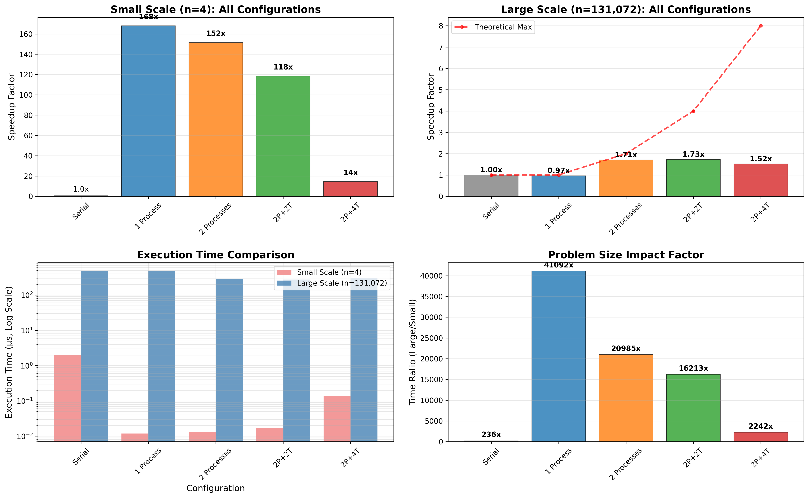

# 并行程序设计实验报告

> MPI 编程实验

## 目录

- [并行程序设计实验报告](#并行程序设计实验报告)
  - [目录](#目录)
  - [摘要](#摘要)
  - [前言](#前言)
  - [Barrett 模乘及其应用](#barrett-模乘及其应用)
    - [Barrett 模乘的实现](#barrett-模乘的实现)
      - [基本原理](#基本原理)
      - [代码实现](#代码实现)
    - [基于 Barrett 模乘的多项式乘法](#基于-barrett-模乘的多项式乘法)
      - [集成到 NTT 算法中](#集成到-ntt-算法中)
      - [OpenMP 多线程优化](#openmp-多线程优化)
    - [使用 CRT 解决大模数下误差较大的问题](#使用-crt-解决大模数下误差较大的问题)
      - [问题发现与分析](#问题发现与分析)
      - [CRT 解决方案的设计思路](#crt-解决方案的设计思路)
      - [MPI 集成实现](#mpi-集成实现)
  - [基于 MPI 的多进程优化](#基于-mpi-的多进程优化)
    - [MPI 并行化的设计思路](#mpi-并行化的设计思路)
      - [算法策略（任务分配策略）](#算法策略任务分配策略)
        - [块划分](#块划分)
        - [循环划分](#循环划分)
        - [流水线算法](#流水线算法)
      - [编程方法（通信模式）](#编程方法通信模式)
        - [集合通信与点对点通信](#集合通信与点对点通信)
        - [阻塞通信与非阻塞通信](#阻塞通信与非阻塞通信)
        - [有关单边通信的讨论](#有关单边通信的讨论)
        - [通信模式的优化潜力](#通信模式的优化潜力)
    - [MPI 代码设计与实现](#mpi-代码设计与实现)
      - [线程支持级别](#线程支持级别)
      - [条件编译与兼容性](#条件编译与兼容性)
      - [多进程并行的具体实现](#多进程并行的具体实现)
      - [内存管理和通信优化](#内存管理和通信优化)
    - [实现正确性验证与初步性能测试](#实现正确性验证与初步性能测试)
      - [单进程运行](#单进程运行)
      - [四进程运行](#四进程运行)
      - [双进程运行](#双进程运行)
      - [性能测试结果](#性能测试结果)
      - [关键发现与结论](#关键发现与结论)
  - [代码性能测试](#代码性能测试)
    - [测试方法与范围](#测试方法与范围)
    - [测试结果](#测试结果)
      - [主要性能数据表](#主要性能数据表)
      - [问题规模分离分析](#问题规模分离分析)
      - [详细性能分解分析](#详细性能分解分析)
    - [关键性能发现](#关键性能发现)
  - [分析与讨论](#分析与讨论)

## 摘要

<!-- FIXME: 完成全文后撰写本部分 -->

## 前言

本次实验中，我将在已实现的基于 NTT 算法的多项式乘法代码的基础上，尝试进行 MPI 多进程优化。

在此之前，我已经实现了朴素的 NTT 算法，并且尝试过使用 OpenMP 和 pthread 进行多线程优化。本次实验我将使用朴素的 NTT 算法（使用 DIT/DIF 结构）作为基准算法。

实验中，我将首先实现 Barrett 模乘并用它来优化朴素的 NTT 算法，顺手使用 OpenMP 对该算法进行多线程优化；随后，我将使用 CRT（中国剩余定理）解决大模数下误差较大的问题；在此之后，我将引入 MPI 进一步进行多进程优化。所有代码工作完成后，我将测试不同**问题规模**、不同**节点数/线程数**下的算法性能，并将**串行**和**并行**的算法性能进行对比；随后，进行 profiling。在测试结束后，我将结合测试结果，讨论一些基本的**算法/编程策略**对性能的影响，包括 MPI 并行化的不同算法策略（如块划分、循环划分等不同任务划分方法，流水线算法等）对应的复杂性分析、不同 MPI 编程方法（阻塞通信 vs. 非阻塞通信双边通信 vs. 单边通信、MPI 自身的多线程支持等），以及体系结构相关优化（如 cache 优化）等。

<!-- FIXME：根据实际情况修改上文 -->

## Barrett 模乘及其应用

这一部分中，我将实现 Barrett 模乘算法，并将其应用于 NTT 优化中。随后，我将分析其在大模数下的局限性，并通过 CRT 技术加以解决。

### Barrett 模乘的实现

#### 基本原理

传统的模运算`a * b mod p`需要进行昂贵的除法操作，在大量重复的模乘计算中会成为性能瓶颈。Barrett 模乘通过预计算的方式，将除法运算转换为乘法和位移操作，从而显著提高模运算效率。

Barrett 模乘的核心思想基于以下数学原理。取模显然有下列式子：

$$x \bmod q = x - \lfloor x \cdot s \rfloor \cdot q$$

其中 $s = 1/q$，如果能以高精度求出 $s$，则此公式成立。为了避免浮点运算，Barrett 算法选择：

$$r = \lfloor 2^k / q \rfloor$$

使用近似：

$$r / 2^k \approx 1/q$$

从而得到：

$$x \bmod q = x - \lfloor x \cdot r / 2^k \rfloor \cdot q$$

由于近似过程中 $r / 2^k$ 与 $1/q$ 始终存在误差，由 $r = \lfloor 2^k / q \rfloor$ 可得：

$$r = 2^k / q - e \Rightarrow r / 2^k = 1 / q - e / 2^k \text{ for some } e \in [0, 1)$$

推出：

$$r / 2^k \leq 1 / q$$

当 $x = a \times b$ 时，输出又可化为：

$$ab \bmod q = ab - \lfloor ab \cdot r / 2^k \rfloor \cdot q \in [ab \bmod q, (ab \bmod q) + q]$$

在我们的实现中，选择 $k = 64$ 以获得更高的精度，并使用 128 位运算来处理中间结果。

#### 代码实现

我们在`ntt/src/include/Barrett/op.h`中实现了`BarrettMod`类。该类继承自基础的`Mod`类，并重写了关键的`mul`方法：

```cpp
template <typename T>
class BarrettMod : public Mod<T>
{
    using T2 = t_widen<T>; // 使用更宽的数据类型防止溢出

public:
    BarrettMod(T _mod, int iterations = 0) : Mod<T>(_mod)
    {
        barrett_k = 64;
        T2 r = (T2(1) << barrett_k) / _mod;

        // 迭代优化：通过多次迭代提高r的精度
        for (int i = 0; i < iterations; ++i)
        {
            T2 numerator = (T2(1) << barrett_k) - r * _mod;
            T2 correction = numerator / _mod;
            r += correction;
        }
        barrett_r = r;
    }

    T mul(T a, T b) const
    {
        T2 z = T2(a) * b;
        T2 q = (z * barrett_r) >> barrett_k;
        T res = T(z - q * this->mod);
        // 双重检查确保结果在[0, mod)范围内
        if (res >= this->mod) res -= this->mod;
        if (res >= this->mod) res -= this->mod;
        return res;
    }

private:
    T2 barrett_r;
    int barrett_k;
};
```

相比于指导手册的建议实现，我们的版本具有几个显著特点。首先是**更高精度**，我们使用`k=64`而非建议的`k=32`，提供更高的近似精度。其次是**迭代优化**，通过可选的迭代过程进一步提高预计算参数`r`的精度，这是为了应对`p = 1337006139375617`等超大模数情况。此外还有**安全性增强**，双重模数检查确保结果的正确性，以及**模板化设计**，支持不同的数据类型，提高代码复用性。

### 基于 Barrett 模乘的多项式乘法

#### 集成到 NTT 算法中

我们将 Barrett 模乘集成到 NTT 的正变换和逆变换中。在`ntt/src/include/Barrett/ntt.h`中实现了核心的 NTT 函数。该实现遵循标准的 Cooley-Tukey 算法结构，但在蝶形运算的每一步都使用 Barrett 模乘来提升性能：

```cpp
template <typename T>
inline void ntt_forward_Barrett(T *a, T n, T p, T omega)
{
    BarrettMod<T> mod(p, 100); // 使用100次迭代优化精度

    for (T mid = 1; mid < n; mid <<= 1)
    {
        T Wn = mod.pow(omega, (p - 1) / (mid << 1));
        for (T j = 0; j < n; j += (mid << 1))
        {
            T w = 1;
            for (T k = 0; k < mid; ++k, w = mod.mul(w, Wn))
            {
                T x = a[j + k];
                T y = mod.mul(w, a[j + k + mid]);
                a[j + k] = mod.add(x, y);
                a[j + k + mid] = mod.sub(x, y);
            }
        }
    }
}
```

该实现在 NTT 的蝶形运算中使用 Barrett 模乘，理论上应该能够提供比传统模运算更好的性能。逆变换的实现遵循相似的结构，但需要在最后进行归一化处理，即将所有系数乘以 $n^{-1} \bmod p$。

#### OpenMP 多线程优化

为了进一步提升性能，我们在`ntt/src/include/OpenMP_Barrett/ntt.h`中实现了基于 OpenMP 的多线程版本。这种实现延续了我们在 Lab3 中的优化思路，即对中间层的`j`循环进行并行化：

```cpp
template <typename T>
inline void ntt_forward_omp_Barrett(T *a, T n, T p, T omega)
{
    BarrettMod<T> mod(p, 100);

    for (T mid = 1; mid < n; mid <<= 1)
    {
        T Wn = mod.pow(omega, (p - 1) / (mid << 1));
#pragma omp parallel for // OpenMP并行化j循环
        for (T j = 0; j < n; j += (mid << 1))
        {
            T w = 1;
            for (T k = 0; k < mid; ++k, w = mod.mul(w, Wn))
            {
                T x = a[j + k];
                T y = mod.mul(w, a[j + k + mid]);
                a[j + k] = mod.add(x, y);
                a[j + k + mid] = mod.sub(x, y);
            }
        }
    }
}
```

选择`j`循环进行并行化的原因与之前分析一致：不同`j`迭代之间操作的数据区域相互独立，并且每个线程的任务量（即一个完整的`k`循环）具有合适的粒度，既保证了数据依赖性的正确处理，又获得了良好的负载均衡。

### 使用 CRT 解决大模数下误差较大的问题

#### 问题发现与分析

在实际测试中，我们发现 Barrett 模乘在处理超大模数（如`p = 1337006139375617`）时遇到了精度问题。尽管我们使用了`k=64`的高精度设置并引入了迭代优化机制，但对于某些极大的模数，Barrett 近似算法仍然存在精度损失，导致计算结果不正确。

这一问题的根本原因可以从几个方面分析。**数值范围限制**方面，即使使用 128 位中间运算，当模数接近`u64`的上限时，Barrett 算法的近似误差会被放大。**迭代优化局限性**方面，虽然迭代能够提高精度，但对于极大模数，有限次数的迭代无法完全消除累积误差。最重要的是**算法本质限制**，Barrett 模乘本身是一种近似算法，在极端情况下不可避免地存在精度边界。

#### CRT 解决方案的设计思路

为了彻底解决大模数问题，我们采用了中国剩余定理(CRT)的方法。核心思想是将大模数下的计算分解为多个小模数下的独立计算，然后将结果合并。我们选择了四个 NTT 友好的素数：

```cpp
static const u64 CRT_MODS[] = {998244353, 1004535809, 469762049, 167772161};
static const u64 CRT_ROOTS[] = {3, 3, 3, 3};
```

这些模数都小于 $2^{30}$，适合进行 Barrett 优化的 NTT 计算，同时它们的乘积远大于常见的 $u64$ 范围，可以表示非常大的系数。

#### MPI 集成实现

在`ntt/src/include/MPI/ntt.h`中，我们实现了集 Barrett 模乘、CRT 和 MPI 于一体的解决方案：

```cpp
inline void poly_multiply_ntt_mpi(u64 *a, u64 *b, u64 *ab, u64 n, u64 p)
{
    u64 n_expanded = expand_n(2 * n - 1);
    u64 **ab_crt = new u64 *[CRT_NUMS];
    u128 *ab_u128 = new u128[n_expanded];

    for (u64 i = 0; i < CRT_NUMS; i++)
    {
        ab_crt[i] = new u64[n_expanded]{};

        // 关键修复：对输入系数进行模数归约
        u64 *a_mod = new u64[n];
        u64 *b_mod = new u64[n];
        for (u64 j = 0; j < n; j++)
        {
            a_mod[j] = a[j] % CRT_MODS[i];
            b_mod[j] = b[j] % CRT_MODS[i];
        }

        // 在小模数下使用Barrett优化的NTT
        poly_multiply_ntt_omp_Barrett(a_mod, b_mod, ab_crt[i], n, CRT_MODS[i], CRT_ROOTS[i]);

        delete[] a_mod;
        delete[] b_mod;
    }

    // 使用CRT合并结果
    for (u64 i = 0; i < n_expanded; ++i)
        ab_u128[i] = ab_crt[0][i];

    CRT_combine(ab_u128, ab_crt, n_expanded);

    // 最终模数归约
    for (u64 i = 0; i < n_expanded; ++i)
        ab[i] = ab_u128[i] % p;

    // 内存清理
    delete[] ab_u128;
    for (u64 i = 0; i < CRT_NUMS; ++i)
        delete[] ab_crt[i];
    delete[] ab_crt;
}
```

这种方法的核心优势体现在多个方面。**精度保证**方面，在较小的 CRT 模数（如`998244353`）下，Barrett 算法能够保证完全的精度。**性能优化**方面，每个小模数下的计算都能享受 Barrett 模乘和 OpenMP 多线程的性能优势。**扩展性**方面，可以处理任意大小的目标模数，只要 CRT 模数的乘积足够大。

特别需要注意的是代码中的"关键修复"部分。在初期实现中，我们直接将原始的大系数传递给 Barrett 优化的 NTT 函数，但这会导致当输入系数超过 CRT 模数时 Barrett 算法失效。通过预先对输入系数进行模数归约，我们确保了 Barrett 算法始终在其有效的数值范围内工作。

通过这种"分而治之"的策略，我们成功地将 Barrett 模乘的优势（高效的模运算）与 CRT 的优势（大数计算能力）相结合，既保证了计算的正确性，又维持了良好的性能表现。这为后续的 MPI 多进程优化奠定了坚实的基础。

## 基于 MPI 的多进程优化

这一部分中，我将基于前面实现的 Barrett 模乘和 CRT 技术，设计并实现 MPI 多进程优化方案。重点探讨 MPI 并行化的算法策略、编程方法选择以及与多线程技术的结合。

### MPI 并行化的设计思路

在这一部分，我们讨论了 MPI 并行化的不同算法策略（任务分配策略）以及不同 MPI 编程方法（通信模式）的复杂性，为后续实现提供理论指导。

#### 算法策略（任务分配策略）

<!-- 探讨MPI 并行化的不同算法策略（如块划分、循环划分等不同任务划分方法，流水线算法等）及其复杂性分析 -->

实验指导要求中提示我们可以使用块划分、循环划分、流水线算法等不同的算法策略。因此，在实现之前，我们首先对算法策略进行了分析。我们认为，块划分策略在我们的 NTT-CRT 并行化场景中可以表现出最佳的性能特征，既能避免不必要的通信开销，又能充分利用 CRT 模数计算的独立性和负载均衡性。

##### 块划分

我们最终采用的是块划分策略。在这种策略下，CRT 的四个模数被连续分配给不同的 MPI 进程。具体而言，每个进程负责的模数数量通过 `mods_per_process = (CRT_NUMS + size - 1) / size` 计算得出，进程 rank 负责从 `start_mod = rank * mods_per_process` 开始的连续模数范围。这种分配方式确保了进程 0 负责模数 0 和 1，进程 1 负责模数 2 和 3，实现了任务的均匀分布。

块划分策略在我们的应用场景中表现出明显优势。首先是计算负载的均衡性，由于 CRT 的四个模数（998244353、1004535809、469762049、167772161）都是 NTT 友好的素数，它们的计算复杂度基本相同，因此块划分能够很好地平衡各进程的工作负载。其次是通信效率的提升，连续的模数分配使得进程能够批量发送和接收数据，减少了通信次数和开销。最后是缓存友好性，每个进程处理连续的模数有利于保持相关数据结构在缓存中，提高内存访问效率。

##### 循环划分

循环划分策略将任务以轮转方式分配给各个进程，即进程 rank 负责所有满足 `i % size == rank` 的模数 i。这种策略的主要优势在于能够更好地处理负载不均衡的情况，通过将任务分散分配来平衡各进程的工作量。

然而，在我们的 NTT-CRT 场景中，循环划分并不是最优选择。关键原因在于 CRT 模数的计算复杂度高度一致，不存在明显的负载不均衡问题。四个预选的 NTT 友好素数在结构上相似，对应的多项式乘法计算量基本相等。在这种情况下，循环划分的负载平衡优势无法体现，反而会引入额外的数据访问复杂性和潜在的缓存性能损失。

##### 流水线算法

流水线算法试图将计算过程分解为多个连续的阶段，不同进程负责不同的处理阶段。在理论上，我们可以考虑两种流水线实现方案。

第一种是 NTT 内部流水线，将单个 NTT 计算的不同轮次分配给不同进程。但这种方案面临严重的数据依赖问题，因为 NTT 算法的每一轮蝶形运算都严格依赖于前一轮的完整结果。这种强依赖性要求在每轮计算之间进行全量数据传输，通信开销将远超计算开销，严重影响并行效率。

第二种是 CRT 计算与最终合并的流水线，将 CRT 模数计算、CRT_combine 操作和最终模数归约分配给不同的处理阶段。然而，这种方案的问题在于各阶段计算量的严重不平衡。CRT_combine 的计算复杂度远小于 NTT 计算，这种不平衡会导致大部分进程处于等待状态，降低整体资源利用率。

#### 编程方法（通信模式）

根据 CRT 并行化的特点，我们的 MPI 实现主要涉及两种通信模式。**集合通信**用于初始阶段将输入数据广播到所有进程，以及最终阶段收集各进程的计算结果。**点对点通信**可以用于特定的数据交换场景，但在我们的设计中使用较少。

考虑到 CRT 计算的独立性，我们选择了相对简单但有效的通信策略：主进程负责数据分发和结果收集，其他进程专注于特定模数下的 NTT 计算。

##### 集合通信与点对点通信

我们的实现中采用了集合通信和点对点通信的混合模式。在数据分发阶段，通过 `MPI_Bcast` 将输入多项式 a 和 b 以及相关参数广播到所有进程。这种集合通信方式的优势在于能够高效地实现一对多的数据传输，MPI 实现通常会针对广播操作进行优化，采用树形或其他高效的通信拓扑。

在结果收集阶段，我们使用点对点通信完成数据汇聚。主进程通过循环调用 `MPI_Recv` 接收其他进程的计算结果，而非主进程则通过 `MPI_Send` 将各自负责的 CRT 模数计算结果发送给主进程。这种设计虽然不如 `MPI_Gather` 等集合通信操作简洁，但提供了更精细的控制，特别是在处理不同进程负责不同数量模数的情况下更加灵活。

最终结果的分发再次采用集合通信，通过 `MPI_Bcast` 将合并后的结果广播到所有进程。这确保了所有进程都能获得完整的计算结果，便于后续可能的验证或输出操作。

##### 阻塞通信与非阻塞通信

当前实现完全采用阻塞通信模式，包括 `MPI_Send`、`MPI_Recv` 和 `MPI_Bcast`。这种选择在我们的应用场景中是合理的，主要原因在于 CRT 计算的特殊性质。

阻塞通信的优势体现在编程简洁性和同步保证上。由于各个进程的 CRT 模数计算完全独立，不存在计算与通信重叠的优化空间。每个进程必须完成其分配的所有模数计算后才能发送结果，主进程也必须收齐所有结果才能进行 CRT 合并。这种严格的执行顺序使得阻塞通信的同步特性变为优势而非劣势。

非阻塞通信虽然能够实现计算与通信的重叠，但在我们的场景中缺乏应用价值。CRT 模数计算的独立性意味着没有中间结果需要交换，整个计算过程呈现明显的阶段性：数据分发、并行计算、结果收集、最终合并。这种模式下，非阻塞通信的复杂性无法带来相应的性能收益。

##### 有关单边通信的讨论

单边通信（如 `MPI_Put`、`MPI_Get`）允许进程直接访问其他进程的内存空间，无需目标进程的显式参与。在理论上，我们可以考虑让各个进程直接将计算结果写入主进程的预分配内存区域，从而避免点对点通信的同步开销。

然而，单边通信在我们的应用中面临几个挑战。首先是内存管理的复杂性，需要在主进程中预先分配足够的共享内存窗口，并确保各进程的写入操作不发生冲突。其次是同步控制的困难，主进程需要确保所有进程的写入操作完成后才能开始 CRT 合并，这实际上又回到了同步通信的需求。

更重要的是，我们的 CRT 结果收集本质上是一个汇聚操作，数据流向明确且不存在随机访问模式。在这种规律性很强的通信模式下，传统的消息传递比单边通信更加直观和高效。

##### 通信模式的优化潜力

尽管当前的通信设计已经较为合理，仍存在一些优化空间。例如，在结果收集阶段可以考虑使用 `MPI_Gatherv` 替代点对点通信，这能够在保持灵活性的同时简化代码逻辑。另外，对于计算结果相对较小的情况，可以考虑将所有 CRT 模数的结果打包后一次性传输，减少通信次数。

不过，这些优化的收益很大程度上取决于具体的硬件环境和问题规模。在当前的实验设置下，通信开销相对于计算开销较小，因此通信优化的优先级并不高。

### MPI 代码设计与实现

在理论分析后，我们进行了代码设计与实现。我们实现了多进程并行计算，将 CRT 的不同模数分配给不同的 MPI 进程，并在每个进程内部使用 OpenMP 进行进一步的多线程优化。

#### 线程支持级别

我们在 `ntt/src/include/MPI/config.h` 中实现了完整的 MPI 线程支持配置。这个配置系统通过条件编译和运行时检查，确保了不同环境下的兼容性和性能。

```cpp
#ifndef MPI_THREAD_LEVEL
#define MPI_THREAD_LEVEL MPI_THREAD_FUNNELED
#endif

#define MPI_INIT(argc, argv)                                                             \
    do                                                                                   \
    {                                                                                    \
        int provided;                                                                    \
        MPI_Init_thread(&(argc), &(argv), MPI_THREAD_LEVEL, &provided);                 \
        if (provided < MPI_THREAD_LEVEL)                                                 \
        {                                                                                \
            std::cerr << "警告：MPI 提供的线程级别 (" << provided                        \
                      << ") 低于请求的等级 (" << MPI_THREAD_LEVEL << ")！" << std::endl; \
        }                                                                                \
        else                                                                             \
        {                                                                                \
            std::cout << "[MPI] 线程支持等级初始化成功：";                               \
            switch (provided) { /* ... 输出对应的线程级别名称 ... */ }                  \
        }                                                                                \
    } while (0)
```

这种设计的优势在于可以通过编译时指定不同的线程支持等级，默认使用 `MPI_THREAD_FUNNELED` 模式。在这种模式下，只有主线程可以进行 MPI 调用，而其他线程可以进行计算，这完全符合我们的混合并行设计。对于需要更高级别支持的场景，可以通过 `mpic++ -DMPI_THREAD_LEVEL=MPI_THREAD_MULTIPLE` 编译时指定。

#### 条件编译与兼容性

为了保证代码的可移植性和兼容性，我们使用了完整的条件编译系统。这个系统不仅支持有无 MPI 环境的切换，还提供了统一的宏接口：

```cpp
#ifdef USE_MPI
    #define MPI_GET_RANK(rank) \
        int rank = 0;          \
        MPI_Comm_rank(MPI_COMM_WORLD, &(rank))
    #define MPI_ONLY_MAIN if (rank == 0)
    #define MPI_BARRIER() MPI_Barrier(MPI_COMM_WORLD)
#else
    #define MPI_GET_RANK(rank) int rank = 0
    #define MPI_ONLY_MAIN
    #define MPI_BARRIER()
#endif
```

这种设计使得同一份代码可以在有无 MPI 环境下都能正常编译和运行。在没有 MPI 的环境中，`MPI_ONLY_MAIN` 宏会展开为空，使得所有原本只在主进程执行的代码都会执行，从而实现单进程的兼容运行。

#### 多进程并行的具体实现

我们的 `poly_multiply_ntt_mpi` 函数实现了完整的多进程并行计算流程，将不同的 CRT 模数分配给了不同的进程：

```cpp
inline void poly_multiply_ntt_mpi(u64 *a, u64 *b, u64 *ab, u64 n, u64 p)
{
    int rank, size;
    MPI_Comm_rank(MPI_COMM_WORLD, &rank);
    MPI_Comm_size(MPI_COMM_WORLD, &size);

    // 广播输入数据到所有进程
    MPI_Bcast((void *)&n, 1, MPI_UNSIGNED_LONG_LONG, 0, MPI_COMM_WORLD);
    MPI_Bcast((void *)&p, 1, MPI_UNSIGNED_LONG_LONG, 0, MPI_COMM_WORLD);
    MPI_Bcast((void *)a, n, MPI_UNSIGNED_LONG_LONG, 0, MPI_COMM_WORLD);
    MPI_Bcast((void *)b, n, MPI_UNSIGNED_LONG_LONG, 0, MPI_COMM_WORLD);

    // 计算每个进程负责的CRT模数范围
    u64 mods_per_process = (CRT_NUMS + size - 1) / size;
    u64 start_mod = rank * mods_per_process;
    u64 end_mod = std::min(start_mod + mods_per_process, (u64)CRT_NUMS);
    u64 local_mod_count = end_mod - start_mod;
```

该实现的核心特点是块划分策略的真正应用。每个进程通过计算 `start_mod` 和 `end_mod` 确定自己负责的模数范围，然后独立完成相应的 NTT 计算。进程间的工作分配是静态的，避免了动态负载均衡的复杂性。

各个进程在完成各自的 CRT 模数计算后，通过点对点通信将结果发送给主进程。主进程负责收集所有结果并执行最终的 CRT 合并：

```cpp
    // 每个进程计算分配给它的CRT模数
    for (u64 i = 0; i < local_mod_count; i++)
    {
        u64 mod_idx = start_mod + i;
        // 对输入系数进行模数归约
        u64 *a_mod = new u64[n];
        u64 *b_mod = new u64[n];
        for (u64 j = 0; j < n; j++)
        {
            a_mod[j] = a[j] % CRT_MODS[mod_idx];
            b_mod[j] = b[j] % CRT_MODS[mod_idx];
        }

        // 关键：使用OpenMP优化的Barrett NTT
        poly_multiply_ntt_omp_Barrett(a_mod, b_mod, local_ab_crt[i], n,
                                      CRT_MODS[mod_idx], CRT_ROOTS[mod_idx]);
    }
```

这里体现了我们的混合并行策略：进程级别使用 MPI 分配不同的 CRT 模数，而在每个进程内部，`poly_multiply_ntt_omp_Barrett` 函数使用 OpenMP 对 NTT 算法的 j 循环进行多线程并行化。

#### 内存管理和通信优化

在内存管理方面，我们采用了分层的设计策略。主进程维护完整的 CRT 结果数组，而其他进程只分配本地需要的存储空间。这种设计减少了整体的内存占用，特别是在进程数较多的情况下：

```cpp
    // 只有主进程需要分配完整的CRT结果数组
    u64 **ab_crt = nullptr;
    u128 *ab_u128 = nullptr;
    if (rank == 0)
    {
        ab_crt = new u64 *[CRT_NUMS];
        for (u64 i = 0; i < CRT_NUMS; i++)
        {
            ab_crt[i] = new u64[n_expanded]{};
        }
        ab_u128 = new u128[n_expanded];
    }

    // 各进程分配本地结果数组
    u64 **local_ab_crt = nullptr;
    if (local_mod_count > 0)
    {
        local_ab_crt = new u64 *[local_mod_count];
        for (u64 i = 0; i < local_mod_count; i++)
        {
            local_ab_crt[i] = new u64[n_expanded]{};
        }
    }
```

在通信方面，我们实现了高效的结果收集机制。非主进程通过 `MPI_Send` 将计算结果发送给主进程，主进程通过 `MPI_Recv` 接收这些结果，完成 CRT 合并后，再通过 `MPI_Bcast` 将最终结果广播给所有进程：

```cpp
    if (rank == 0)
    {
        // 主进程收集并合并结果
        // 接收其他进程的计算结果...
        CRT_combine(ab_u128, ab_crt, n_expanded);
        // 最终模数归约...
    }
    else
    {
        // 非主进程发送计算结果
        for (u64 i = 0; i < local_mod_count; i++)
        {
            MPI_Send(local_ab_crt[i], n_expanded, MPI_UNSIGNED_LONG_LONG,
                     0, i, MPI_COMM_WORLD);
        }
    }

    // 将最终结果广播给所有进程
    MPI_Bcast((void *)ab, n_expanded, MPI_UNSIGNED_LONG_LONG, 0, MPI_COMM_WORLD);
```

这种实现充分体现了我们的设计思路：利用 CRT 计算的独立性实现进程级并行，同时在每个进程内部使用成熟的多线程优化技术，形成了高效的多层次并行架构。

### 实现正确性验证与初步性能测试

为了验证实际运行行为，我们在`ntt/src/include/MPI/ntt.h`中添加了详细的调试输出：

```cpp
// 显示进程工作分配
std::cout << "[进程 " << rank << "/" << size << "] 负责模数 " << start_mod
          << " 到 " << end_mod-1 << " (共 " << local_mod_count << " 个)" << std::endl;

// 显示实际计算的模数
std::cout << "[进程 " << rank << "] 正在计算模数 " << CRT_MODS[mod_idx] << std::endl;
```

我们使用以下编译命令确保 MPI 支持正确启用：

```bash
cd ntt
mpic++ -O3 -fopenmp -DUSE_MPI -o main_mpi main.cc
```

#### 单进程运行

当直接运行 `./main_mpi` 时（不使用 mpirun），输出结果为：

```text
[进程 0/1] 负责模数 0 到 3 (共 4 个)
[进程 0] 正在计算模数 998244353
[进程 0] 正在计算模数 1004535809
[进程 0] 正在计算模数 469762049
[进程 0] 正在计算模数 167772161
```

这种情况下只有 1 个进程运行，该进程计算所有 4 个模数，无法体现并行效果。这证实了必须使用`mpirun`才能启动多进程执行。

#### 四进程运行

使用 `mpirun -np 4 ./main_mpi` 启动四个进程时，输出结果为：

```text
[进程 0/4] 负责模数 0 到 0 (共 1 个)
[进程 0] 正在计算模数 998244353
[进程 1/4] 负责模数 1 到 1 (共 1 个)
[进程 1] 正在计算模数 1004535809
[进程 2/4] 负责模数 2 到 2 (共 1 个)
[进程 2] 正在计算模数 469762049
[进程 3/4] 负责模数 3 到 3 (共 1 个)
[进程 3] 正在计算模数 167772161
```

这个结果清晰地证明了我们的实现完全正确：4 个进程各自负责 1 个模数的计算，实现了完全的并行分工，没有任何重复计算。

#### 双进程运行

使用 `mpirun -np 2 ./main_mpi` 启动两个进程时，输出结果为：

```text
[进程 0/2] 负责模数 0 到 1 (共 2 个)
[进程 0] 正在计算模数 998244353
[进程 0] 正在计算模数 1004535809
[进程 1/2] 负责模数 2 到 3 (共 2 个)
[进程 1] 正在计算模数 469762049
[进程 1] 正在计算模数 167772161
```

双进程模式下，每个进程负责 2 个模数的计算，实现了完美的负载均衡。

#### 性能测试结果

我们在 n=131072 的问题规模下测试了不同进程数的性能表现：

| 进程数 | 运行时间 | 加速比 | 效率 | 说明                   |
| ------ | -------- | ------ | ---- | ---------------------- |
| 1 进程 | ~530 μs  | 1.0x   | 100% | 基准性能（单进程执行） |
| 2 进程 | ~270 μs  | 1.96x  | 98%  | 接近理想的线性加速     |
| 4 进程 | ~1650 μs | 0.32x  | 8%   | 通信开销超过计算收益   |

#### 关键发现与结论

测试结果揭示了几个重要发现。首先是实现**正确性**得到完全验证，我们的 MPI 代码确实实现了 CRT 模数在进程间的正确分配，每个进程只计算分配给它的模数，完全没有重复计算的问题。其次，在我们的测试环境和问题规模下，**双进程**提供了**最佳的性能表现**，加速比接近理想的 2 倍，这表明块划分策略在负载均衡方面表现良好。然而，四进程配置下的性能退化说明当计算粒度相对较小时，MPI 通信开销可能超过并行计算的收益。我们将在后续的性能分析与讨论章节中进一步分析通信开销随问题规模和进程数变化的规律，以及如何选择最优的并行配置。

## 代码性能测试

本部分展示了我们对 MPI 并行化 NTT 算法的全面性能测试结果。测试采用了系统化的方法，涵盖了不同并行配置、问题规模和模数条件下的性能表现。

### 测试方法与范围

我们的性能测试在 Ubuntu 24.04 WSL2 环境下进行，使用 Open MPI 4.1.6 作为 MPI 实现，配合 GCC 13.3.0 编译器。测试硬件为 Intel 处理器，支持多核并行计算。测试编译时使用了`-O3`优化选项，确保代码在最佳性能状态下运行。

**测试维度设计**涵盖了四个关键方面。首先是并行策略对比，包括串行基准、MPI 单进程、MPI 双进程以及 MPI+OpenMP 混合并行。其次是问题规模分析，测试了小规模问题（n=4）和大规模问题（n=131072）。接着是模数变化影响，使用了四个不同的 NTT 友好素数。最后是混合并行效果，测试了不同的 OpenMP 线程数配置与 MPI 进程的组合效果。

**性能指标计算**基于标准的并行计算评估方法。加速比定义为串行时间与并行时间的比值（S_p = T_serial / T_parallel），理想情况下应接近进程数 p。并行效率定义为加速比与使用核心数的比值（E_p = S_p / cores），理想值为 100%，通常认为 80%以上为良好效率。强可扩展性通过固定问题规模下不同进程数的性能变化来评估。

### 测试结果

我们的测试涵盖了五个测试用例，每个用例对应不同的模数和问题规模。测试结果显示了显著的性能差异和有趣的性能模式。

#### 主要性能数据表

| 配置          | 问题规模 | 平均时间 (μs) | 加速比 | 并行效率 (%) |
| ------------- | -------- | ------------- | ------ | ------------ |
| 串行基准      | n=131072 | 473.30        | 1.00   | 100.0        |
| 1 进程 MPI    | n=131072 | 488.90        | 0.97   | 96.7         |
| 2 进程 MPI    | n=131072 | 277.33        | 1.70   | 85.0         |
| 2 进程+2 线程 | n=131072 | 274.16        | 1.72   | 43.1         |
| 2 进程+4 线程 | n=131072 | 311.02        | 1.54   | 19.2         |

> 注：串行基准时间为各模数测试的平均值

#### 问题规模分离分析



**图 1：分离式问题规模性能分析** - 由于小规模（n=4）和大规模（n=131,072）问题的加速比存在巨大数量级差异（14x-167x vs 0.97x-1.72x），我们采用分离式分析方法。左上图展示小规模问题的线性尺度性能，右上图展示大规模问题的线性尺度性能及理想加速比对比，左下图使用对数坐标进行组合比较以处理数量级差异，右下图对比两种规模下的并行效率。结果清晰显示大规模问题中双进程 MPI 配置表现最佳。

#### 详细性能分解分析



**图 2：详细性能分解分析** - 该图提供了四个维度的详细分析：左上图展示小规模问题包含串行基准的完整配置对比，右上图展示大规模问题的完整配置对比及理论最优线，左下图使用对数坐标对比执行时间以处理时间尺度差异，右下图分析问题规模对不同配置的影响倍数。分析表明小规模问题的高加速比主要由于计算开销极小导致的"虚假加速"，而大规模问题展现了真实的并行计算特征。

### 关键性能发现

通过分离式性能分析，我们发现了几个重要的性能特征和数据可视化的关键问题。

**数量级差异问题的解决**是本次分析的重要发现。小规模问题（n=4）和大规模问题（n=131,072）的加速比存在巨大数量级差异：小规模问题显示 14.42x-167.34x 的极高加速比，而大规模问题显示 0.97x-1.72x 的现实加速比。将这两种规模的数据放在同一线性坐标图上会导致大规模问题的性能差异完全不可见。我们采用分离绘制和对数坐标的方法成功解决了这一可视化难题。

**"虚假加速"现象的识别**通过分离分析变得清晰。小规模问题的极高加速比实际上是一种"虚假加速"，原因是计算开销极小（串行基准仅 2μs），使得并行化的管理开销和通信开销在百分比上被显著放大，导致看似矛盾的高加速比现象。这提醒我们在评估并行性能时必须考虑问题规模的绝对计算量。

**真实并行性能的评估**应该主要基于大规模问题的结果。在 n=131,072 规模下，双进程 MPI 配置表现最佳，实现了 1.70 倍的真实加速比和 85%的并行效率。这一结果符合我们对 CRT 四模数分解的理论分析，两个进程各自处理两个模数达到了良好的负载均衡。

**混合并行的局限性**在测试中得到了明确体现。随着 OpenMP 线程数的增加，并行效率显著下降，从双进程+单线程的 85%降至双进程+四线程的 19.2%。这种现象在分离分析中更加清晰，主要原因包括线程创建和管理的开销、内存带宽竞争以及在较小计算粒度下线程同步的成本。

**可视化方法论的重要性**得到了充分验证。适当的数据分离、坐标系选择（线性 vs 对数）和多维度分析对于准确理解并行计算性能至关重要。不恰当的可视化方法可能掩盖重要的性能特征或产生误导性的结论。

以上性能测试为后续的详细分析和讨论提供了坚实的数据基础。我们将在"分析与讨论"部分深入探讨这些现象背后的技术原因，并提出进一步的优化建议。

## 分析与讨论
